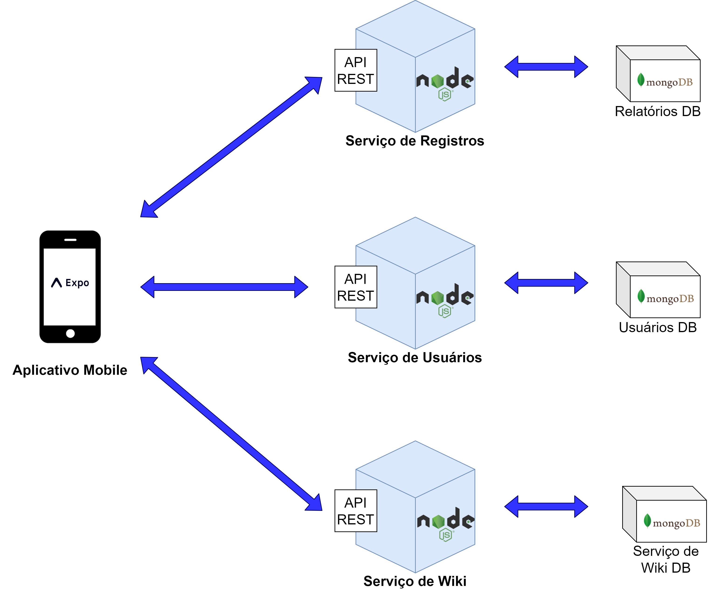
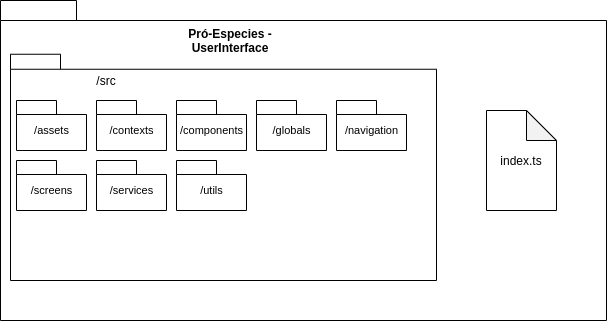
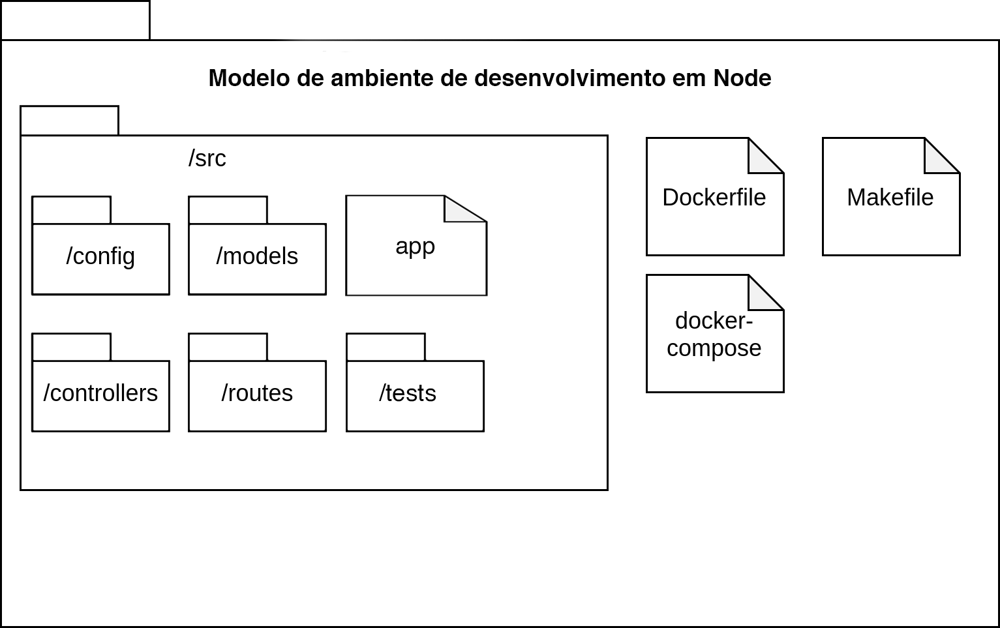
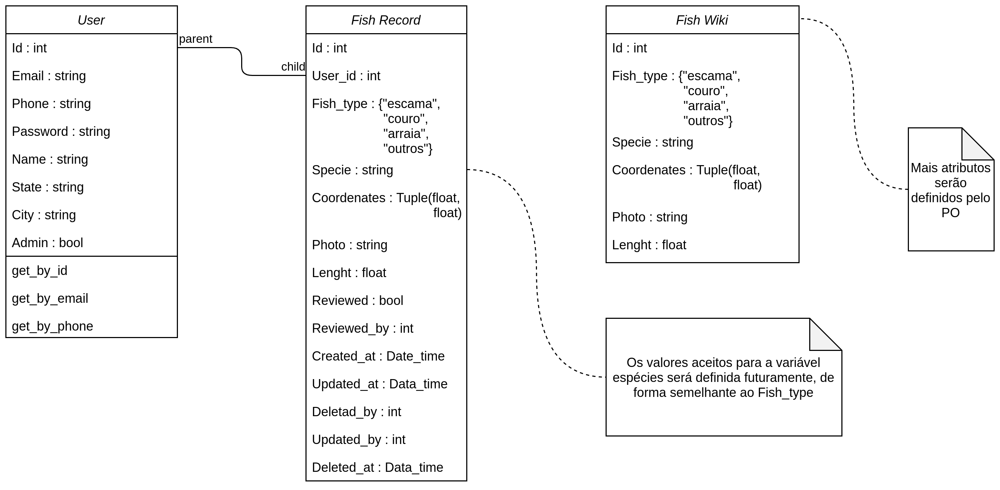

# Documento de Arquitetura

|    Data    | Versão |                      Descrição                       |                           Autor                            |
| :--------: | :----: | :--------------------------------------------------: | :--------------------------------------------------------: |
| 20/08/2021 |  0.1   | Criação do documento de Arquitetura                                |   [Natan Tavares Santana](https://github.com/Neitan2001)     |
| 20/08/2021 |  0.2   | Criação dos diagramas de Casos de Uso                              |   [Natan Tavares Santana](https://github.com/Neitan2001)     |
| 21/08/2021 |  0.3   | Criação do tópico de Introdução                                    |   [João Victor Batista](https://github.com/jvBatista)        |
| 21/08/2021 |  0.4   | Criação do tópico de Representação da Arquitetura                  |   [Natan Tavares Santana](https://github.com/Neitan2001)     |
| 21/08/2021 |  0.5   | Criação do tópico de Metas e Restrições da Arquitetura             |   [Paulo Henrique Rezende](https://github.com/phrezende-eng) |
| 21/08/2021 |  0.6   | Criação do tópico de Visão Lógica                                  |   [Natan Tavares Santana](https://github.com/Neitan2001)     |
| 21/08/2021 |  1.0   | Adição do diagrama de pacotes do biblioteca de dados               |   [Natan Tavares Santana](https://github.com/Neitan2001)     |
| 25/08/2021 |  1.1   | Revisão do documento, correção de erros e formatação do documento  |   [Lucas Fellipe](https://github.com/lucasfcm9)     |
| 28/08/2021 |  1.2   | Revisão da Representação arquitetural e adição do diagrama de classes  |   [Iuri Severo](https://github.com/iurisevero)     |
| 04/09/2021 |  1.3   | Remoção do Diagrama de Casos de Uso |   [João Pedro Guedes](https://github.com/sudjoao)     |
| 07/09/2021 |  1.4   | Atualização do Diagrama de Classes, da Visão Lógica (tópico 4) e da Representação Arquitetural (tópico 2) |   [Iuri Severo](https://github.com/iurisevero)     |

## 1. Introdução

### 1.1 Finalidade

 &emsp;&emsp;Este documento de arquitetura tem o objetivo de apresentar uma visão sobre a arquitetura utilizada pelo aplicativo Pró-Espécies Peixes e mostrar como são feitas as conexões entre os elementos utilizados para que o <i>software</i> funcione. A comunicação dele com <i>containers</i> e banco de dados são alguns destes elementos.

### 1.2 Escopo

 &emsp;&emsp;O Pró-Espécies Peixes é um aplicativo <i>mobile</i> cuja finalidade principal é permitir a criação, edição, validação e exportação de relatórios de campo sobre espécies ictiológicas nativas do estado do Tocantins, Brasil. O objetivo principal do aplicativo é o levantamento e recolhimento de dados científicos de tais espécies para pesquisadores da região. Neste documento serão exploradas todas as estruturas necessárias para o funcionamento do aplicativo e a devida arquitetura desse *software*, como por exemplo diagrama de relações, visão de casos de uso, visão lógica do produto, etc.

### 1.3 Referências

- *Como documentar a Arquitetura de Software*. Disponível em: <http://www.linhadecodigo.com.br/artigo/3343/como-documentar-a-arquitetura-de-software.aspx>. Acesso em: 20 ago. 2021.
- *Documento de Arquitetura*. ADA. Disponível em: <https://fga-eps-mds.github.io/2019.1-ADA/#/docs/project/architecture_doc?id=_1-introdu%c3%a7%c3%a3o>. Acesso em: 20 ago. 2021.
- *Documento de Arquitetura*. AIX. Disponível em: <https://fga-eps-mds.github.io/2019.1-Aix/projeto/2019/03/29/documento-de-arquitetura/>. Acesso em: 20 ago. 2021.
- *Documento de Arquitetura*. Lend.it. Disponível em: <https://fga-eps-mds.github.io/2020.2-Lend.it/#/_docs/projeto/documento_arquitetura>. Acesso em: 20 ago. 2021.

## 2. Representação da Arquitetura

### 2.1 Diagrama de Relações

O Pró-Espécies Peixes funciona com base na seguinte representação arquitetural:

 &emsp;&emsp;O projeto é modelado em arquitetura de microsserviços, que visa implementar pequenos serviços independentes e modularizados. Abaixo será explicado quais são os microsserviços e suas relações com os outros

#### 2.1.1 Serviço de Relatórios

Esse microsserviço é responsável por tudo que é relacionado aos relatórios de peixes, desde a criação do relatório pelo pescador até a validação pelo pesquisador. Além disso, esse serviço permitirá ao pescador e ao pesquisador editar ou remover relatórios pendentes.

#### 2.1.2 Serviço de Usuários

Esse microsserviço é responsável pelo gerenciamento de usuários na plataforma, como a criação e a diferenciação de tipos de usuários: Pescadores e Pesquisadores.

#### 2.1.3 Biblioteca de Dados

Esse microsserviço é responsável pelo armazenamento de dados sobre Peixes, adquiridos  a partir do consumo de uma planilha de informações disponibilizada pelos pesquisadores,  a fim de fornecer conhecimentos que ajudem os pescadores a fazerem relatórios mais exatos.

### 2.2 Tecnologias

#### Flutter
*Flutter* é um kit de desenvolvimento de interface de usuário, de código aberto, criado pelo *Google*, que possibilita a criação de aplicativos compilados nativamente.

#### Node.js
O *Node.js* é um ambiente de execução JavaScript *server-side*, permitindo criar aplicações JavaScript para rodar como uma aplicação *standalone* em uma máquina, não dependendo de um *browser* para a execução.

#### MongoDB
*MongoDB* é um *software* de banco de dados orientado a documentos livres, de código aberto e multiplataforma. É classificado como um programa de banco de dados *NoSQL*. Além disso, o *MongoDB* usa documentos semelhantes a *JSON* com esquemas.

#### Git
*Git* é uma Ferramenta de versionamento que será usada em conjunto com o GitHub para salvar os dados do decorrer do projeto, possibilitando a hospedagem e a geração de *backups* do mesmo.

#### Docker
*Docker* é uma ferramenta para gerar um ambiente isolado e construído especificamente para a equipe que será utilizado para facilitar o desenvolvimento do projeto.

## 3. Metas e Restrições da Arquitetura
## 3.1 Metas do Software Pró-espécies Peixes
Com o intuito de ajudar pesquisadores, pescadores convencionais e esportivos, o Pró-espécies Peixes visa:
 - Guiar as *personas* na busca por certos tipos de peixes;
 - Ajudar pesquisadores a encontrar diferentes tipos de espécies de peixes;
 - Apresentar dados relevantes sobre peixes para todas as *personas*;
 - Coletar informação de peixes ainda não conhecidos;
 - Guardar a quantidade de peixes coletados de cada indivíduo.

## 3.2 Restrições da arquitetura
As restrições de arquitetura são:
 - Ter acesso à *internet*;
 - Possuir a plataforma atualizada para a última versão que o software requer;
 - Ter conta na *App Store* ou *Play Store*.

## 4. Visão Lógica

 &emsp;&emsp;A visão lógica será representada por dois diagramas de pacotes, um para tecnologias adotadas no <i>frontend</i> do projeto e um para as tecnologias do <i>backend</i>.
  &emsp;&emsp;O modelo de ambiente de desenvolvimento em <i>Node</i> será usado como base para organização dos repositórios de <a href="https://github.com/fga-eps-mds/2021.1-Pro-Especies-User">Usuários</a>, <a href="https://github.com/fga-eps-mds/2021.1-Pro-Especies-FishLog">Relatórios</a> e <a href="https://github.com/fga-eps-mds/2021.1-Pro-Especies-Wiki">Biblioteca de Dados</a>, enquanto o modelo de ambiente de desenvolvimento em <i>Flutter</i> será usado para o repositório responsável pelo <a href="https://github.com/fga-eps-mds/2021.1-Pro-Especies-Frontend">Aplicativo Mobile</a>.

### 4.1 Diagrama de Pacotes

#### Aplicativo Mobile

#### Serviço de Usuários, Relatórios e Biblioteca de Dados

## 5. Visão de Implementação

 &emsp;&emsp;A visão de implementação apresenta os detalhes de implementação do sistema. O Diagrama de Classes é uma de suas principais representações.

### 5.1 Diagrama de Classes v1.1

 &emsp;&emsp;O Diagrama de Classes é uma representação da estrutura e relações das classes que servem de modelo para os objetos.

<a href="https://github.com/fga-eps-mds/2021.1-Pro-Especies-Docs/blob/dc33e69d07c98d0e85e17a05afa6ed82d8fa388e/docs/Assets/Images/ArchitectureDocument/ClassDiagram.png">Link para acesso a versão 1.0 do Diagrama de Classes</a>

 &emsp;&emsp; O diagrama acima representa os três principais serviços levantados para o produto. A associação entre usuário e registro de peixes será utilizada para relacionar os objetos gerados.
