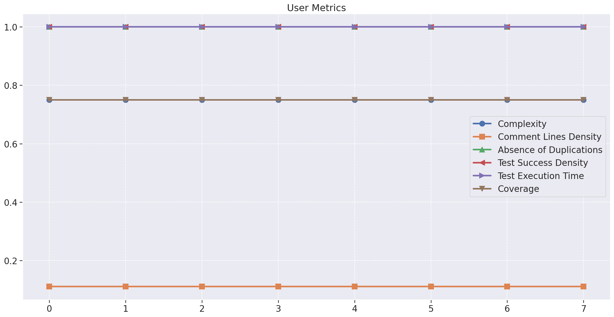
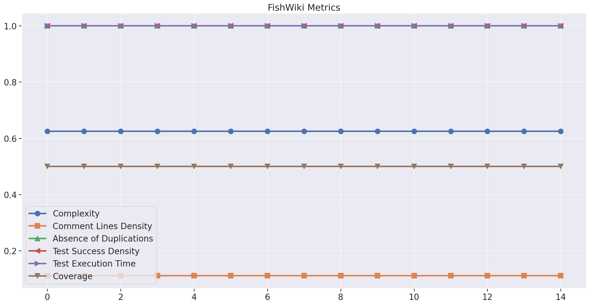
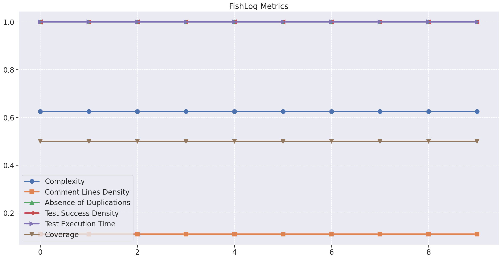
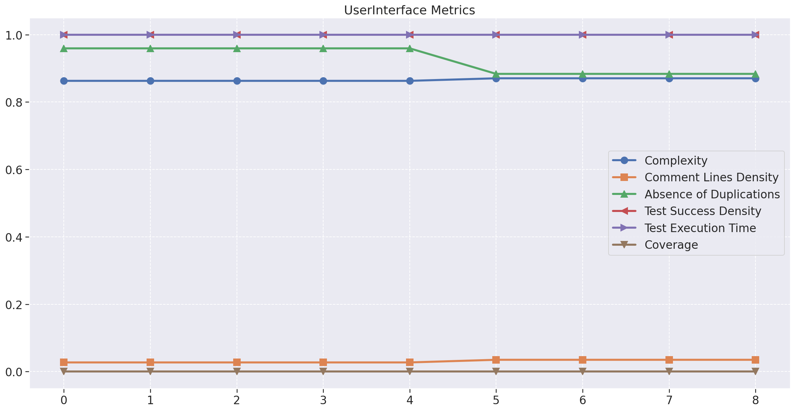
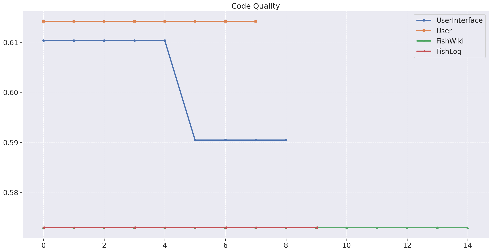
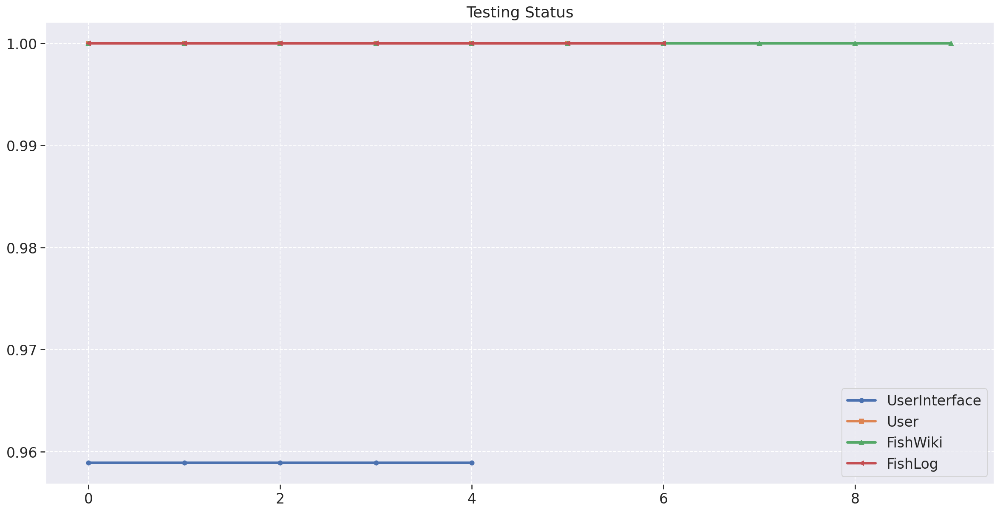
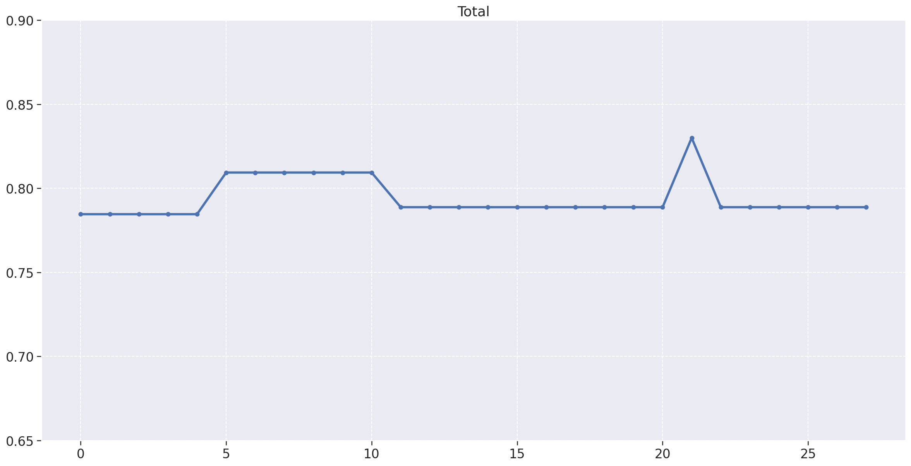

# Análise da Qualidade do Produto
|    Data    | Versão | Descrição | Autor |
| :---: | :----: | :--: | :---: |
| 08/11/2021 | 1.0 | Documentação do Análise de Qualidade | [Iuri Severo](https://github.com/iurisevero)|

## Introdução

A análise de qualidade do produto foi gerada a partir do modelo de qualidade QRapids, utilizando as métricas Complexidade (_Complexity_), Densidade de linhas comentadas (_Comment Lines Density_), Densidade de linhas duplicadas (_Duplicated Lines Density_), Densidade de testes bem sucedidos (_Test Success Density_), Tempo de execução de testes (_Test Execution Time_) e Cobertura de testes (_Coverage_).

Utilizando o notebook de desenvolvimento python [analytics.ipynb](../../Analytics/analytics.ipynb) foram gerados os gráficos apresentados a seguir.

## Gráficos das métricas

### Repositório _User_

### Repositório _FishWiki_

### Repositório _FishLog_

### Repositório _UserInterface_

### Total Qualidade de Código

### Status dos Testes

### Total Qualidade do Produto

## Conclusão

A partir da análise dos gráficos gerados no notebook, nota-se que a métrica de **Densidade de linhas comentadas** é muito baixa em todos repositório. Esse fator resultou na queda dos valores de qualidade de código na análise geral dos repositórios, entretanto, o **Cobertura de testes**, que se manteve alta durante todo desenvolvimento, fez com que esses valores fossem alanvacados, resultando em uma boa qualidade do produto final.

Os valores numéricos dos dados utilizados para montar os gráficos pode ser vistos no arquivo [fga-eps-mds-Pro-Especies-DATASET-2021-11-08.csv](../../Analytics/data/fga-eps-mds-Pro-Especies-DATASET-2021-11-08.csv)

<!-- 
Testes > 60% garantiram nível alto nas métricas
Falta de comentários diminuiu a qualidade de código
As primeira release já foi major nos repositórios do back, oq criou a estabilidade no gráfico
-->