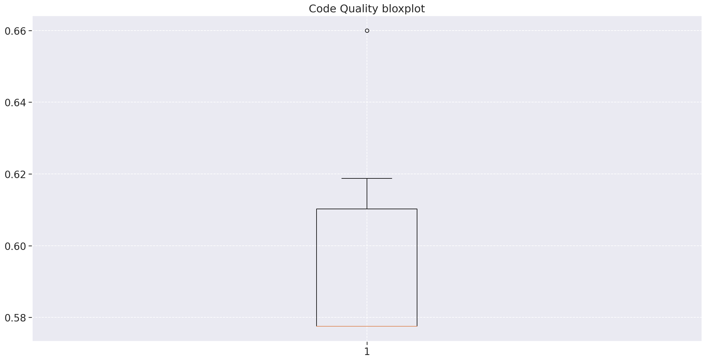
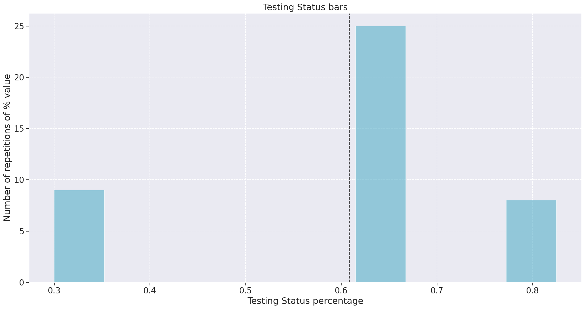
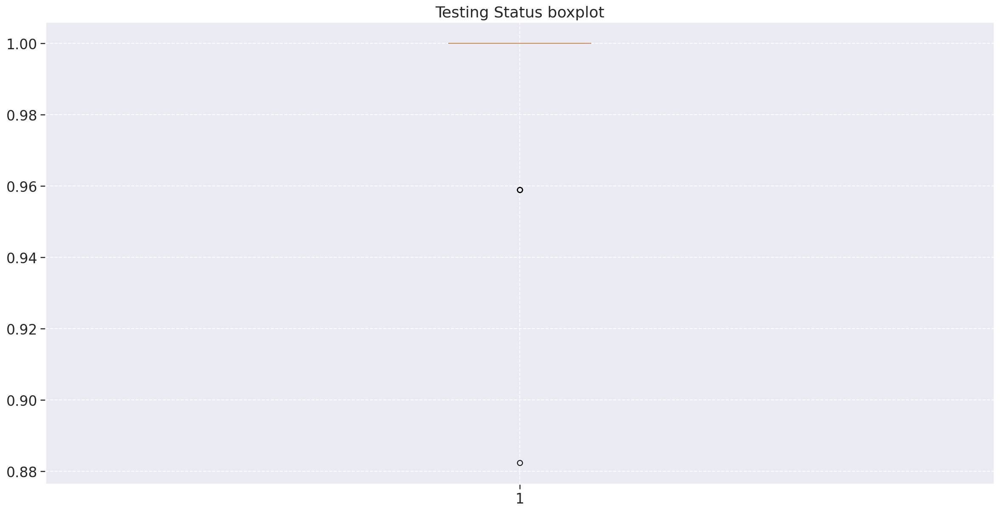
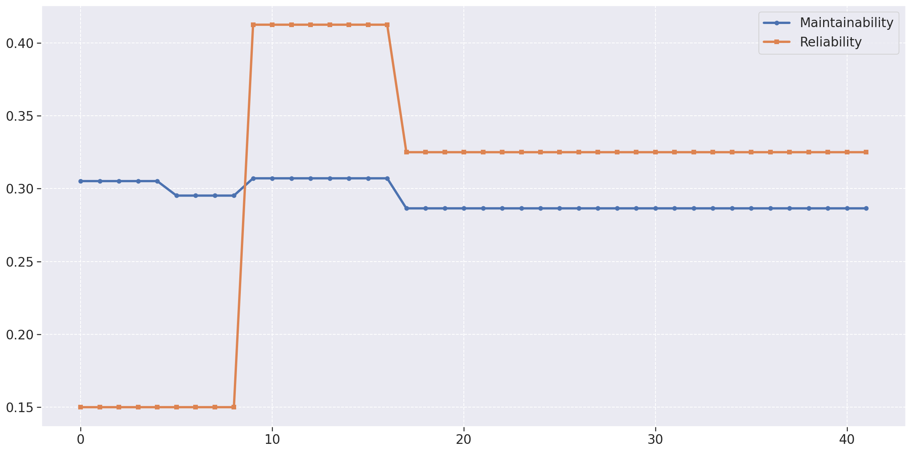
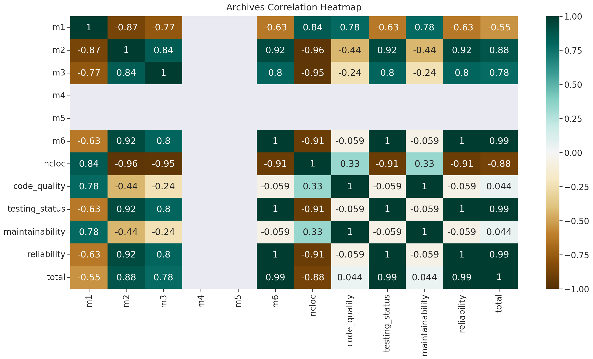

# Análise da Qualidade do Produto
|    Data    | Versão | Descrição | Autor |
| :---: | :----: | :--: | :---: |
| 08/11/2021 | 1.0 | Documentação do Análise de Qualidade | [Iuri Severo](https://github.com/iurisevero)|
| 10/11/2021 | 1.1 | Adição do heatmap, gráficos em barra e boxplot | [Iuri Severo](https://github.com/iurisevero) |
| 11/11/2021 | 1.2 | Correção linkagem das imagens | [Iuri Severo](https://github.com/iurisevero) |

## Introdução

A análise de qualidade do produto foi gerada a partir do modelo de qualidade QRapids, utilizando as métricas Complexidade (_Complexity_), Densidade de linhas comentadas (_Comment Lines Density_), Densidade de linhas duplicadas (_Duplicated Lines Density_), Densidade de testes bem sucedidos (_Test Success Density_), Tempo de execução de testes (_Test Execution Time_) e Cobertura de testes (_Coverage_).

Utilizando o notebook de desenvolvimento python [analytics.ipynb](https://github.com/fga-eps-mds/2021.1-Pro-Especies-Docs/blob/main/Analytics/analytics.ipynb) foram gerados os gráficos apresentados a seguir.

## Gráficos das métricas

### Repositório _User_

### Repositório _FishWiki_

### Repositório _FishLog_

### Repositório _UserInterface_

### Qualidade de Código

### Status dos Testes

### Total Qualidade do Produto

## Conclusão

A partir da análise dos gráficos gerados no notebook, nota-se que a métrica de **Densidade de linhas comentadas** é muito baixa em todos repositório. Esse fator resultou na queda dos valores de qualidade de código na análise geral dos repositórios, entretanto, os **Status de testes**, que se manteve com uma média de 99% durante o desenvolvimento, fez com que esses valores fossem alanvacados, resultando em uma boa qualidade do produto final.

Os valores numéricos dos dados utilizados para montar os gráficos pode ser vistos no arquivo [fga-eps-mds-Pro-Especies-DATASET-2021-11-10.csv](https://github.com/fga-eps-mds/2021.1-Pro-Especies-Docs/blob/main/Analytics/data/fga-eps-mds-Pro-Especies-DATASET-2021-11-10.csv)

<!-- 
Testes > 60% garantiram nível alto nas métricas
Falta de comentários diminuiu a qualidade de código
As primeira release já foi major nos repositórios do back, oq criou a estabilidade no gráfico
-->