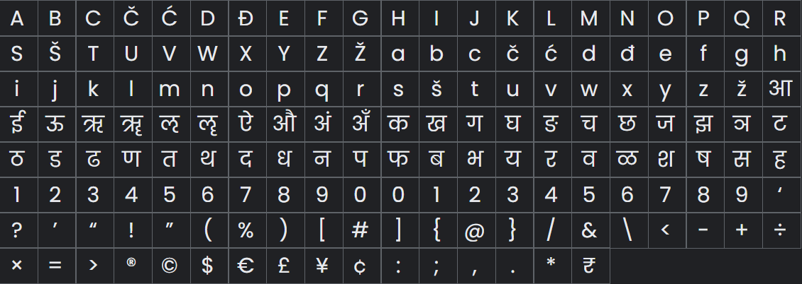

# Identidade Visual

|    Data    | Versão | Descrição | Autor |
| :---: | :----: | :--: | :---: |
| 25/09/2021 | 1.0 | Documentação da IDV | [Iuri Severo](https://github.com/iurisevero)|

## Logomarca

A logomarca foi criada com base em uma imagem retirada do galeria gratuita do [ManyPixels](https://www.manypixels.co/gallery). A imagem foi adaptada com as cores definidas para o produto.

### Texto

### Imagem

## Cores

&emsp;&emsp;A escolha de cores foi feita a partir de um breve estudo sobre as teorias das cores. Deste modo foram definidos o azul, como cor principal e o verde como cor secundária.

* Azul: É uma cor capaz de estimular a criatividade em um ambiente e transmitir a sensação de sucesso e conquista. Está associada a paz, a tranquilidade, a unidade e a água.
* Verde: É capaz de trazer sensações de equilíbrio, harmonia e, como já imaginado, tem grande referência quando o assunto é natureza e meio ambiente. A cor também remete a generosidade.

&emsp;&emsp;A partir da escolha das cores principais, foi utilizada a ferramenta <a href="https://getmdl.io/customize/index.html">getmdl</a>, da Google, para selecionar a tonalidade do azul, segundo as cores utilizadas no Material Design. A tonalidade de azul escolhida foi a #00BBD4.

<table align="center">
    <tr>
        <td>
            
        </td>
        <td> 
            

                <b>Hexadecimal: </b> 00BBD4  
                <b>Pantone: </b> 20-0171 TPM  
                <b>RGB: </b> 0, 187, 212  
                <b>CMYK: </b> 100, 12, 0, 17  
                <b>HSV: </b> 187, 100, 83  
                <b>LAB: </b> 70, -30, -24  
            

        </td> 
    </tr>
</table>

&emsp;&emsp;Utilizando a ferramenta <a href="https://color.adobe.com/pt/create/color-wheel">Adobe Color</a> foram definidas as cores análogas e complementares. Desta forma foram criados tons de azul escuro, verde azulado, amarelo e vermelho.

<table align="center">
    <tr>
        <td>
            
        </td>
        <td> 
            

                <b>Hexadecimal: </b> 62EEFF  
                <b>Pantone: </b> 20-0152 TPM  
                <b>RGB: </b> 98, 238, 255  
                <b>CMYK: </b> 62, 7, 0, 0  
                <b>HSV: </b> 186, 62, 100  
                <b>LAB: </b> 87, -33, -19  
            

        </td> 
    </tr>
    <tr>
        <td>
            
        </td>
        <td> 
            

                <b>Hexadecimal: </b> 00A156  
                <b>Pantone: </b> 20-0181 TPM  
                <b>RGB: </b> 0, 161, 86  
                <b>CMYK: </b> 100, 0, 47, 37  
                <b>HSV: </b> 152, 100, 63  
                <b>LAB: </b> 58, -53, 29  
            

        </td> 
    </tr>
    <tr>
        <td>
            
        </td>
        <td> 
            

                <b>Hexadecimal: </b> 00D483  
                <b>Pantone: </b> 20-0177 TPM  
                <b>RGB: </b> 0, 212, 131  
                <b>CMYK: </b> 100, 0, 38, 17  
                <b>HSV: </b> 157, 100, 83  
                <b>LAB: </b> 75, -62, 28  
            

        </td> 
    </tr>
    <tr>
        <td>
            
        </td>
        <td> 
            

                <b>Hexadecimal: </b> D49715  
                <b>Pantone: </b> 20-0047 TPM  
                <b>RGB: </b> 212, 151, 21  
                <b>CMYK: </b> 0, 29, 90, 17  
                <b>HSV: </b> 41, 90, 83  
                <b>LAB: </b> 67, 13, 68  
            

        </td> 
    </tr>
    <tr>
        <td>
            
        </td>
        <td> 
            

                <b>Hexadecimal: </b> D43015  
                <b>Pantone: </b> 20-0061 TPM  
                <b>RGB: </b> 212, 48, 21  
                <b>CMYK: </b> 0, 77, 90, 17  
                <b>HSV: </b> 8, 90, 83  
                <b>LAB: </b> 47, 62, 53  
            

        </td> 
    </tr> 
</table>

&emsp;&emsp;Por fim, para as mensagens do aplicativo e outras formas de texto foram escolhidas as seguintes cores neutras.

<table align="center">
    <tr>
        <td>
            
        </td>
        <td> 
            

                <b>Hexadecimal: </b> FFFFFF  
                <b>Pantone: </b> 20-0081 TPM  
                <b>RGB: </b> 255, 255, 255  
                <b>CMYK: </b> 0, 0, 0, 0  
                <b>HSV: </b> 0, 0, 100  
                <b>LAB: </b> 100, 0, 0  
            

        </td> 
    </tr>
    <tr>
        <td>
            
        </td>
        <td> 
            

                <b>Hexadecimal: </b> B9BBBD  
                <b>Pantone: </b> 20-0002 TPM  
                <b>RGB: </b> 185, 187, 189  
                <b>CMYK: </b> 2, 1, 0, 26  
                <b>HSV: </b> 210, 2, 74  
                <b>LAB: </b> 76, 0, -1  
            

        </td> 
    </tr>
    <tr>
        <td>
            
        </td>
        <td> 
            

                <b>Hexadecimal: </b> 202E35  
                <b>Pantone: </b> 20-0191 TPM  
                <b>RGB: </b> 32, 46, 53  
                <b>CMYK: </b> 40, 13, 0, 79  
                <b>HSV: </b> 200, 40, 21  
                <b>LAB: </b> 18, -4, -6  
            

        </td> 
    </tr>
    <tr>
        <td>
            
        </td>
        <td> 
            

                <b>Hexadecimal: </b> 000000  
                <b>Pantone: </b> 20-0194 TPM  
                <b>RGB: </b> 0, 0, 0  
                <b>CMYK: </b> 0, 0, 0, 100  
                <b>HSV: </b> 0, 0, 0  
                <b>LAB: </b> 0, 0, 0  
            

        </td> 
    </tr>
</table>

## Tipografia

&emsp;&emsp;A fonte escolhida para o projeto foi uma fonte da Google, a fonte <a href"https://fonts.google.com/specimen/Poppins">Poppins</a>. Essa fonte é recomendada para softwares modulares e minimalistas, que possui geometria <i>sans serif</i>. Cada forma de letra é quase monolinear, com correções ópticas aplicadas às juntas do traço, quando necessário, para manter uma cor tipográfica uniforme.

### Glifos de amostra 

## Referências
* [Rockcontent: Entenda o que é Psicologia das Cores e descubra o significado de cada cor](https://rockcontent.com/br/blog/psicologia-das-cores/)
* [MaterialDesign Colors](https://material.io/design/color/the-color-system.html)
* [Top 5 Fonts and its usage](https://medium.muz.li/top-5-fonts-and-its-usage-39fb616f574b)