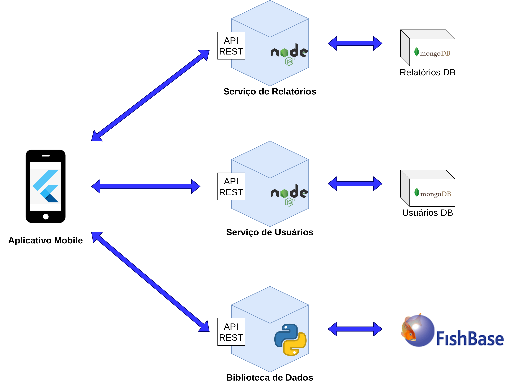
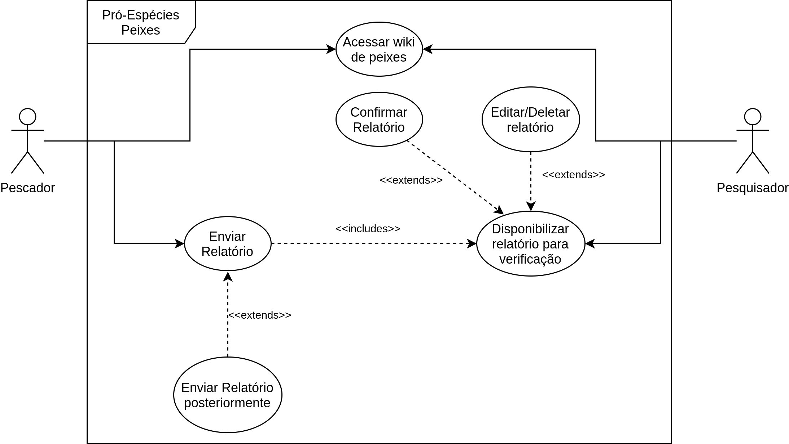

# Documento de Arquitetura

|    Data    | Versão |              Descrição              |                         Autor                          |
| :--------: | :----: | :---------------------------------: | :----------------------------------------------------: |
| 20/08/2021 |  0.1   | Criação do documento de Arquitetura | [Natan Tavares Santana](https://github.com/Neitan2001) |
| 20/08/2021 |  0.2   |              Tópico 4               | [Natan Tavares Santana](https://github.com/Neitan2001) |
| 21/08/2021 |  0.3   |              Tópico 2               | [Natan Tavares Santana](https://github.com/Neitan2001) |

## 2. Representação da arquitetura

### 2.1 Diagrama de relações

O Pró-Espécies Peixes funciona com base na seguinte representação arquitetural:

 &emsp;&emsp;O projeto é modelado em arquitetura de microsserviços, que visa implementar pequenos serviços independetes e modularizados. Abaixo será explicado quais são os microsserviços e suas relações com os outros

#### 2.1.1 Serviço de Relatórios

 &emsp;&emsp;Esse microsserviço é responsável por tudo que é relacionado aos relatórios de peixes, desde a criação do relatório pelo pescador até a validação pelo pesquisador. Além disso, esse serviço permitirá ao pescador e ao pesquisador editar ou remover relatórios pendentes.

#### 2.1.2 Serviço de Usuários

 &emsp;&emsp;Esse microsserviço é responsável pelo gerenciamento de usuários na plataforma, como a criação e a diferenciação de tipos de usuários: Pescadores e Pesquisadores.

#### 2.1.3 Biblioteca de Dados

 &emsp;&emsp;Esse microsserviço é responsável pelo armazenamento de dados de Peixes coletados na FishBase ou cadastrados pelos Pesquisadores na plataforma a fim de disponibilizar informações que ajudem os pescadores a fazerem relatórios com dados mais exatos.

### 2.2 Tecnologias

#### Flutter

 &emsp;&emsp;Flutter é um kit de desenvolvimento de interface de usuário, de código aberto, criado pelo Google, que possibilita a criação de aplicativos compilados nativamente.

#### Node.js

 &emsp;&emsp;O Node.js é um ambiente de execução Javascript server-side, permitindo criar aplicações Javascript para rodar como uma aplicação standalone em uma máquina, não dependendo de um browser para a execução.

#### Python

 &emsp;&emsp;Python é uma linguagem de programação de alto nível, interpretada de script, imperativa, orientada a objetos, funcional, de tipagem dinâmica e forte.

#### MongoDB

 &emsp;&emsp;MongoDB é um software de banco de dados orientado a documentos livre, de código aberto e multiplataforma Classificado como um programa de banco de dados NoSQL, o MongoDB usa documentos semelhantes a JSON com esquemas.

#### Git

 &emsp;&emsp;Ferramenta de versionamento que será usada em conjunto com o GitHub para salvar os dados do decorrer do projeto, possibilitando a hospedagem e a geração de backups do mesmo.

#### Docker

 &emsp;&emsp;Ferramenta para gerar um ambiente isolado e construído especificamente para a equipe que será utilizado para facilitar o desenvolvimento do projeto.

## 4. Visão de Casos de Uso

### 4.1 Diagrama de casos de uso

### 4.2 Especificações dos casos de uso

|                   Casos de Uso                    |          Ator          |                                                 Descrição                                                 |
| :-----------------------------------------------: | :--------------------: | :-------------------------------------------------------------------------------------------------------: |
|             UC01 - Enviar Relatórios              |        Pescador        |              Preencher um relatório com os dados do peixe e enviar o mesmo para ser validado              |
|      UC02 - Enviar Relatórios posteriormente      |        Pescador        | Preencher um relatório do peixe e armazenar no celular para ser enviado assim que tiver acesso à internet |
|           UC03 - Acessar wiki de Peixes           | Pescador e Pesquisador |                           Acessar uma wiki com dados de peixes pré-cadastrados                            |
| UC04 - Disponibilizar relatórios para verificação |      Pesquisador       |                  Acessar relatórios feito por pescadores e visualizar os dados relatados                  |
|            UC05 - Confirmar relatório             |      Pesquisador       |                              Confirmar um relatório enviado por um pescador                               |
|          UC05 - Editar/Deletar Relatório          |      Pesquisador       |                    Editar ou deletar os dados de um relatório enviado por um pescador                     |