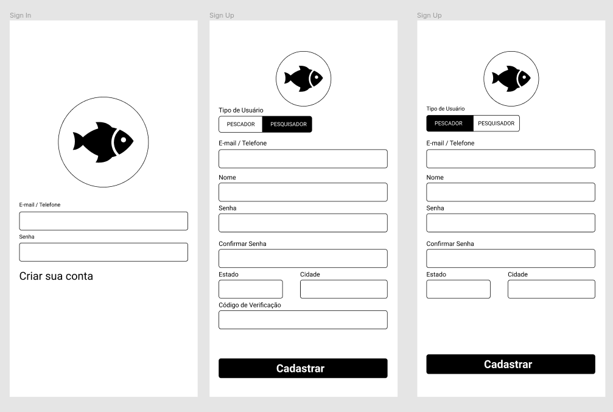
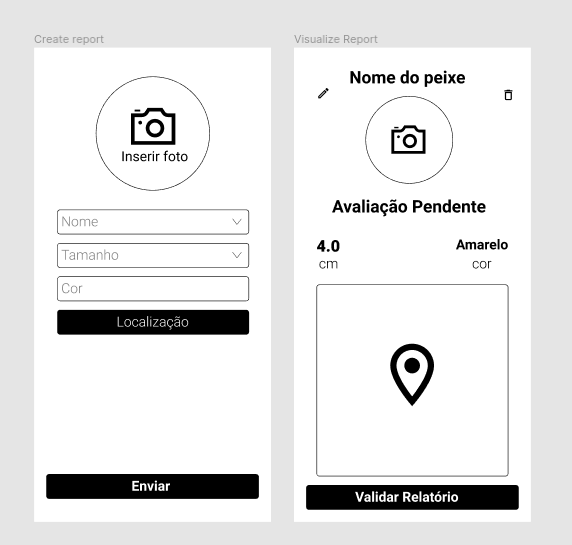
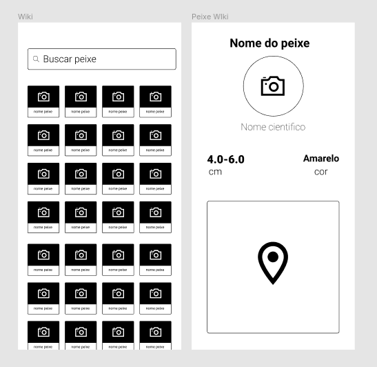
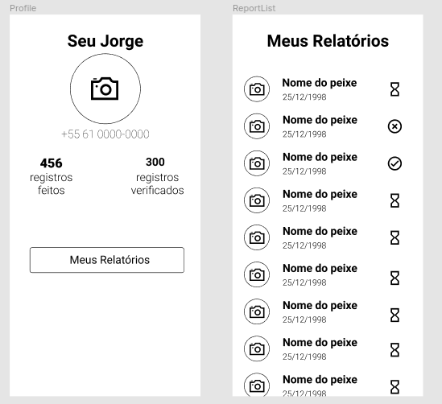

# Protótipo de Média Fidelidade
| Data       | Versão | Descrição            | Autor             |
|:----------:|:------:|:--------------------:|:-----------------:|
| 13/08/2021 | 1.0 | Criação do documento do Protótipo de Média Fidelidade  | [João Guedes](https://github.com/sudjoao) |

A ideia do protótipo de média fidelidade é começar a imaginar como seria construída a funcionalidade e quais seriam seus fluxos.

O grupo realizou o protótipo no [Figma](https://www.figma.com/file/s6YfyPkDcku8vkLnInfeM1/Prot%C3%B3tipo-M%C3%A9dia-Fidelidade?node-id=0%3A1) e conseguiram levantar as ideias utilizando os dados do Lean Inception e dos Protótipos de Baixa fidelidade.

## Fluxos
### Autenticação de Usuário

### Relatórios

### Wiki

### Navegação

### Profile

## Referências
- *Fidelidade de protótipos: Baixa, Média ou Alta, conheça os tipos*. NEVES, Rodrigo. Disponível em <https://www.vitaminaweb.com.br/fidelidade-de-prototipos-baixa-media-ou-alta/>. Acesso em: 13 ago. 2021.
- *Protótipos de baixa, média e alta fidelidade*. ALEX, Jefferson. Disponível em <https://jeffersonalex.com.br/blog/2017/05/07/prototipos-de-baixa-media-e-alta-fidelidade/>. Acesso em: 14 ago. 2021.