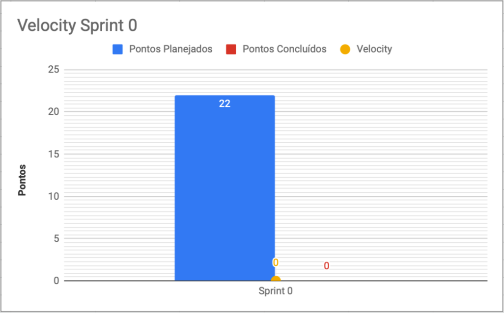

# Resultados da Sprint 0

|    Data    | Versão |         Descrição         |           Autor(es)           |
| :--------: | :----: | :-----------------------: | :---------------------------: |
| 28/08/2021 |  1.0   | Resultados da *Sprint* 0 | [Lucas Fellipe](https://github.com/lucasfcm9) |
| 12/09/2021 |  1.1   | Atualiazação da Pontuação das US (*User Stories*) | [Lucas Fellipe](https://github.com/lucasfcm9) |

**Data**: 28 de Agosto de 2021

**Redigida por**: Lucas Fellipe

**Participantes**: 
* Gabriel Freitas (MDS)
* Iuri Severo (EPS)
* João Pedro (EPS)
* Lucas Fellipe (EPS)
* Natan Tavares (MDS)
* João Victor (MDS)
* Paulo Henrique (MDS)
* Pedro Rodrigues (EPS)

## Fechamento da Sprint

| Issue | Pontos | Status | Observação |
| :---- | :----: | :----: | :----: |
| [E01US01 - Eu, como usuário, desejo poder me cadastrar na plataforma para poder realizar registro e coleta de dados sobre peixes](https://github.com/fga-eps-mds/2021.1-Pro-Especies-Docs/issues/43) | 8 | Não Concluída | Foi realizada somente no *Backend* |
| [E01US02 - Eu, como usuário, desejo acessar minha conta na plataforma para poder realizar registro e coleta de dados sobre peixes](https://github.com/fga-eps-mds/2021.1-Pro-Especies-Docs/issues/45) | 5 | Não Concluída | Foi realizada somente no *Backend* |
| [E01US03 - Eu, como usuário, desejo ser autenticado pelo aplicativo para poder realizar registro e coleta de dados sobre peixes](https://github.com/fga-eps-mds/2021.1-Pro-Especies-Docs/issues/46) | 5 | Não Concluída | Foi realizada somente no *Backend* |
| [E03US04 - Eu, como usuário, desejo poder armazenar dados do fishbase no banco de dados para conseguir informações dos peixes de maneira mais rápida](https://github.com/fga-eps-mds/2021.1-Pro-Especies-Docs/issues/48) | 5 | Não Concluída | - |
| [E03US01 - Eu, como usuário, desejo obter dados do fishbase para obter mais informações sobre os peixes](https://github.com/fga-eps-mds/2021.1-Pro-Especies-Docs/issues/52) | 5 | Não Concluída | - |
| [E03US03 - Eu, como usuário, desejo poder filtrar os peixes cadastrados de acordo com determinado atributo](https://github.com/fga-eps-mds/2021.1-Pro-Especies-Docs/issues/49) | 3 | Não Concluída | - |
| [Documentar Abertura da Sprint 0 e revisar os artefatos](https://github.com/fga-eps-mds/2021.1-Pro-Especies-Docs/issues/44) | 0 | Concluída | - |
| [Configuração do SonarQube no *Frontend*](https://github.com/fga-eps-mds/2021.1-Pro-Especies-Docs/issues/47) | 0 | Não Concluída | - |
| [Elaborar o Plano de Gerenciamento de Custos](https://github.com/fga-eps-mds/2021.1-Pro-Especies-Docs/issues/34) | 0 | Concluída | - |
| [Integração e configuração do banco de dados no *Crawler*](https://github.com/fga-eps-mds/2021.1-Pro-Especies-Docs/issues/41) | 0 | Concluída | - |
| [Configuração do *Lint workflow* dos serviços](https://github.com/fga-eps-mds/2021.1-Pro-Especies-Docs/issues/42) | 0 | Concluída | - |
| [Refinar o *Backlog* do Produto](https://github.com/fga-eps-mds/2021.1-Pro-Especies-Docs/issues/54) | 0 | Concluída | - |
| [Criar Diagrama de Classes](https://github.com/fga-eps-mds/2021.1-Pro-Especies-Docs/issues/51) | 0 | Concluída | - |
| [Refinar o Canvas MVP](https://github.com/fga-eps-mds/2021.1-Pro-Especies-Docs/issues/55) | 0 | Concluída | - |
| [Documentar os Léxicos](https://github.com/fga-eps-mds/2021.1-Pro-Especies-Docs/issues/53) | 0 | Concluída | - |

As seguintes Histórias de Usuário não foram realizadas devido a mudança de planejamento por parte do cliente:
* [E03US04 - Eu, como usuário, desejo poder armazenar dados do fishbase no banco de dados para conseguir informações dos peixes de maneira mais rápida](https://github.com/fga-eps-mds/2021.1-Pro-Especies-Docs/issues/48)
* [E03US01 - Eu, como usuário, desejo obter dados do fishbase para obter mais informações sobre os peixes](https://github.com/fga-eps-mds/2021.1-Pro-Especies-Docs/issues/52)
* [E03US03 - Eu, como usuário, desejo poder filtrar os peixes cadastrados de acordo com determinado atributo](https://github.com/fga-eps-mds/2021.1-Pro-Especies-Docs/issues/49)

__Pontos Planejados:__ 18  
__Pontos Totais Concluídos:__ 0  
[Milestone Sprint 0](https://github.com/fga-eps-mds/2021.1-Pro-Especies-Docs/milestone/4)

## Review

* **Daniel Coimbra**: Não pude agregar ao produto pois toda minha contribuição havia sido no *Crawler*, que foi engavetada. Quanto ao documento dos Léxicos, eu não participei da resolução dessa *issue*.

* **Gabriel Freitas**: Implementou e aprendeu bastante em como resolver as *issues* de cadastro, de *login* e de autenticação com o Paulo Henrique e o Natan Tavares. Isso agrega bastante valor ao produto, pelo fato de ser uma funcionalidade essencial para o aplicativo.

* **Iuri Severo**: Elaborou o diagrama de classes e o DER (Diagrama de Entidade Relacionamento). Além disso, participou das reuniões com o cliente durante a semana. Os diagramas agregam valor ao produto, pelo fato deles orientarem o desenvolvimento.

* **João Pedro**: Elaborou a EVM junto ao Lucas Fellipe e começou a ver a questão do *SonarFlutter* com o Pedro Rodrigues. Além disso, fez o refinamento do *Backlog* do Produto e, também, fez o refinamento do *Backlog* da *Sprint*. A EVM (*Earned Value Management*) traz bastante valor para o produto para o cliente e os desenvolvedores verificarem o que está sendo entregue e o quanto vai demandar de custo, além do valor que a equipe está trazendo para o produto. No caso, o *SonarFlutter* traz valor para a disciplina de MDS/EPS em questão de desenvolvimento.

* **João Victor**: Participou das *issues* que foram canceladas devido aos pontos levantados na reunião com o cliente na Quarta-feira. A partir do meio da semana, pegou as *issues* referentes aos léxicos para a documentação. Essa documentação dos léxicos ajuda no desenvolvimento do produto (na definição dos termos e significados).

* **Lucas Fellipe**: Elaborou a EVM junto ao João Pedro José e documentou as *Sprints*. Além disso, participou das reuniões com o cliente. A EVM agrega valor ao produto pelo fato de mostrar ao cliente o que está sendo planejado e o que foi entregue, além de mostrar o quanto isso vai custar. Além disso, a documentação das *Sprints* ajuda com a rastreabilidade para mostrar o que a equipe está fazendo.

* **Natan Tavares**: Implementou e trabalhou nas *issues* de cadastro, de *login* e de autenticação junto com o Paulo Henrique e o Gabriel Freitas. Essas funcionalidades são os requisitos iniciais do sistema, é o começo do desenvolvimento do *software* em si. A EVM (*Earned Value Management*) traz bastante valor para o produto para o cliente e os desenvolvedores verificarem o que está sendo entregue e o quanto vai demandar de custo, além do valor que a equipe está trazendo para o produto. Já a documentação das *Sprints* traz valor pelo fato da rastreabilidade.

* **Paulo Henrique**: Participou e implementou as issues de cadastro, de *login* e de autenticação) junto com o Natan e o Gabriel. Trabalhou mais na questão de gerar esse *token* para a autenticação. Autenticar o usuário agrega bastante valor, para a questão de segurança do *software*.

* **Pedro Rodrigues**: Trabalhou e implementou o ambiente de desenvolvimento, além de ter configurado o *Crawler*. Adicionou o Lint* no *Backend*. O *Lint* agrega bastante valor ao produto por manter o padrão de código para todos.

### Gráfico de BurnDown de Riscos

### Velocity

## Retrospective

* **Daniel Coimbra**
    * Positivos: Orientação do cliente quanto à biblioteca de peixes da *wiki*;
    * Negativos: Não agreguei valor ao produto nessa *Sprint*;
    * Melhorias: Me organizar mais.
* **Gabriel Freitas**
    * Positivos: O Pareamento com o Paulo Henrique e o Natan Tavares foi ótimo. O compartilhamento de conhecimento foi muito bom. Além disso, a organização dessa semana foi muito boa, além de que tudo foi muito bem detalhado;
    * Negativos: Queria ter mais independência na hora de codificar;
    * Melhorias: Aprender de forma mais rápida as tecnologias.
* **Iuri Severo**
    * Positivos: As *issues* fechadas e o CI (Integração Contínua) funcionando. Além disso, o planejamento e a comunicação dessa *sprint* foram bem melhores do que a anterior;
    * Negativos: A mudança do planejamento depois da reunião com o cliente;
    * Melhorias: Elaborar mais atividades.
* **João Pedro**
    * Positivos: Os pareamentos com o Lucas Fellipe e com o Pedro Rodrigues foram bem positivos. Além disso, a equipe está avançando no projeto e a *Sprint* 0 foi um sucesso, pelo fato de termos concluído todas as *issues*. A equipe está indo atrás de tudo;
    * Negativos: Minha organização. Além disso, a mudança do planejamento depois da reunião com o cliente;
    * Melhorias: Me organizar melhor para as próximas semanas.
* **João Victor**
    * Positivos: Não houve complicações durante a *Sprint*. Além disso, aprendeu bastante sobre os léxicos;
    * Negativos: A mudança do planejamento depois da reunião com o cliente, pois ocasionou no cancelamento de 2 *issues*;
    * Melhorias: Nenhuma, por enquanto.
* **Lucas Fellipe**
    * Positivos: O pareamento com o João Pedro foi excelente. Conseguimos concluir a EVM (*Earned Value Management*). Além disso, conseguimos concluir todas as *issues* propostas. A comunicação e a organizão são sempre fatores positivos;
    * Negativos: Não consegui me organizar direito durante a semana. Além disso, a mudança de planejamento depois da reunião com o cliente;
    * Melhorias: Melhorar a minha organização.
* **Natan Tavares**
    * Positivos: Os pareamentos com o Paulo Henrique e o Gabriel Freitas foram bem positivos. Conseguimos fechar todas as *issues* no tempo certo sem nenhuma complicação; 
    * Negativos: A energia que acabou me impossibilitou de ajudar na última *issue*;
    * Melhorias: Nenhuma, por enquanto.
* **Paulo Henrique**
    * Positivos: Aprendi bastante coisa nessa *sprint* em relação a como funciona uma *Model*, uma *Controller*, uma *Router*, etc. além disso, os pareamentos com o Natan Tavares e o Gabriel Freitas foram ótimos;
    * Negativos: Não consegui me virar com as documentações;
    * Melhorias: Melhorar a minha organização.
* **Pedro Rodrigues**
    * Positivos: Conseguiu fazer bastante *issue* e realizar várias configurações de ambiente. Além disso, conseguiu fazer o *Lint* e configurar o CI (Integração Contínua);
    * Negativos: Pegou bastante *issue* e ficou sobrecarregado. Devido a isso, não conseguiu terminar a configuração do *SonarFlutter* com o João Pedro José;
    * Melhorias: Melhorar a minha organização.

## Quadro de Conhecimento
A equipe de EPS elaborou um quadro de conhecimento com tecnologias consideradas essenciais para o desenvolvimento do produto. É possível ter um *overview* das capacidades da equipe de desenvolvimento (MDS) e gerência (EPS).

<iframe src="https://docs.google.com/spreadsheets/d/e/2PACX-1vSHxsHZdF7aMhOiXfcXzaHDSFw3ABg2JLZFkUhKZ2YRlrnpeho33t196CHZIWyUXhRp2-MjVymqEp4a/pubhtml" width="170px" height="600px"></iframe>

## Avaliação do Scrum Master
A *sprint* 0 teve um grande êxito, a equipe está bem comprometida e a comunicação está constante. Além disso, todas as *issues* foram entregues.

- O ***Product Owner João Pedro José atuou como DevOPS ajudando o Pedro Rodrigues na configuração do SonarFlutter, mas tiveram algumas dificuldades e, com isso, a issue de configuração do SonarFlutter foi passada para a próxima Sprint***