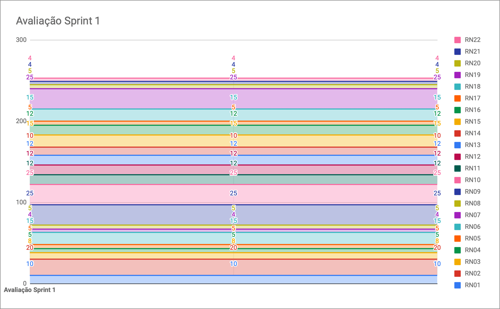

# Resultados da Sprint 1

|    Data    | Versão |         Descrição         |           Autor(es)           |
| :--------: | :----: | :-----------------------: | :---------------------------: |
| 04/09/2021 |  1.0   | Resultados da *Sprint* 1 | [Iuri Severo](https://github.com/iurisevero) |

**Data**: 04 de Setembro de 2021

**Redigida por**: Iuri Severo

**Participantes**: 
* Gabriel Freitas (MDS)
* Iuri Severo (EPS)
* João Pedro (EPS)
* Lucas Fellipe (EPS)
* Natan Tavares (MDS)
* João Victor (MDS)
* Paulo Henrique (MDS)
* Pedro Rodrigues (EPS)

## Fechamento da Sprint

| Issue | Pontos | Status |
| ----- | ------ | ------ |
| [ES02US02 - Eu, como usuário, desejo enviar registro de peixes para o servidor, a fim de realizar a coleta de dados](https://github.com/fga-eps-mds/2021.1-Pro-Especies-Docs/issues/60) | 3 | Concluída |
| [ES04US03 - Eu, como usuário, desejo visualizar um registro selecionado, a fim de realizar a coleta de dados](https://github.com/fga-eps-mds/2021.1-Pro-Especies-Docs/issues/61) | 1 | Concluída |
| [ES06US01 - Eu, como usuário, desejo editar ou remover dados do registro, a fim de aumentar a confiabilidade da coleta de dados](https://github.com/fga-eps-mds/2021.1-Pro-Especies-Docs/issues/62) | 3 | Concluída |
| [E08US02 - Eu, como usuário, desejo acessar o mapa (localização geográfica), a fim de descobrir novas espécies e realizar coleta de dados](https://github.com/fga-eps-mds/2021.1-Pro-Especies-Docs/issues/63) | 3 | Concluída |
| [E08US03 - Eu, como usuário, desejo salvar minha localização marcada no mapa, a fim de ajudar na coleta de dados](https://github.com/fga-eps-mds/2021.1-Pro-Especies-Docs/issues/71) | 3 | Concluída |
| [Definir licença e criar uma tabela explicando cada uma](https://github.com/fga-eps-mds/2021.1-Pro-Especies-Docs/issues/69) | 0 | Concluída |
| Documentar Planning *Sprint* 2 e Fechamento da *Sprint* 1 | 0 | Concluída |
| [Elaborar NFR](https://github.com/fga-eps-mds/2021.1-Pro-Especies-Docs/issues/68) | 0 | Concluída |
| [Revisão do diagrama de Casos de Uso](https://github.com/fga-eps-mds/2021.1-Pro-Especies-Docs/issues/67) | 0 | Concluída |
| [Configuração do SonarQube no *Frontend*](https://github.com/fga-eps-mds/2021.1-Pro-Especies-Docs/issues/47) | 0 | Concluída |
| Criação do repositório e ambiente de configuração de registro de peixes no GitHub | 0 | Concluída |
| Elaborar GQM (*Goal Question Metric*) | 0 | Não Concluída |

__Pontos Planejados:__ 13  
__Pontos Totais Concluídos:__ 13  
[Milestone Sprint 1](https://github.com/fga-eps-mds/2021.1-Pro-Especies-Docs/milestone/5)

## Review

* **Daniel Coimbra**: Contribuiu com o repositório do *Fishlog* e trabalhou na *issue* de *Update* e *Delete* dos registros. Aprendeu *typescript*, agradeceu o Batista e o Nathan por terem ajudado ele. O benefício que essa issue traz para o projeto é a liberdade do usuário e, principalmente, o pesquisador ter o *CRUD* dos registros, para ajudá-los a manipular os dados.

* **Gabriel Freitas**: Mexeu com *Flutter* e com a integração do mapa (localização). Foi divertido, difícil, mas divertido. A parte do *Frontend* é importante por permitir a interação do usuário com o aplicativo.

* **Iuri Severo**: Nessa *Sprint* mexeu mais com documentação. Fez o documento de licenças. Revisou os Casos de Uso e estudou sobre o NFR. Participou da reunião com o Hilmer e planejou o que ia falar. A questão das licenças afeta bastante a questão de como o produto será usado por outras pessoas.

* **João Pedro**: Ficou focado na questão da arquitetura. Atualizou os repositórios, serviços e o próprio documento de arquitetura. Mexeu com o *Sonarflutter* e conseguiu fazer funcionar no ambiente local. Isso não afeta muito o cliente diretamente, mas é importante para nossa avaliação na *Release* 1.

* **João Victor**: Participou e elaborou as *issues* juntamente ao Natan e ao Daniel. *Issue* responsável pelo *CRUD* dos registros e escreveu as US designadas. O CRUD traz valor porque é a base dos dados que serão manipulados no projeto e as US's são importantes, porque são a base da organização do nosso projeto.

* **Lucas Fellipe**: Começou a documentação do GQM junto com o Pedro Rodrigues. Além disso, documentou as *Sprints* e criou e configurou o repositório responsável pelo registro dos peixes no GitHub. O GQM contribui para mostrar a qualidade do projeto. A documentação das *Sprints* agrega no fator de rastreabilidade, para o cliente saber o que a equipe está realizando.

* **Natan Tavares**: Conseguiu trabalhar com autenticação de rotas no *backend*. Fizemos as rotas do *backend* dos registros e as protegemos com o *token* de acesso. Essa funcionalidade garante uma segurança muito maior para o aplicativo que estamos criando.

* **Paulo Henrique**: Participou do desenvolvimento das primeiras partes do *Frontend*. Configurou o acesso ao mapa, o que foi muito trabalhoso. Foram quase 3 dias de configuração antes de conseguir ir para o código em si. Ajudou o Freitas com a *issue dele*, referente a clicar no mapa. Aprendeu bastante coisa. O valor que isso traz para o cliente é a visualização da localização para o registro e a possibilidade de marcar essa posição ao criá-lo.

* **Pedro Rodrigues**: Começou o documento de GQM junto com o Lucas Fellipe. O GQM contribui para o projeto para dar base para medição de qualidade do projeto. Essa semana não conseguiu contribuir muito, pois estava organizando coisas pessoais, o que não influencia direto para o cliente, mas auxilia no desenvolvimento da aplicação.

### Gráfico de BurnDown de Riscos

## Retrospective

* **Daniel Coimbra**
    * Positivos: O Nathan e o Batista sabem muito de Typescript e Node, o que ajudou muito no desenvolvimento da *issue*;
    * Negativos: Estava despreparado por não saber a tecnologia e não conseguiu parear na maior parte da *sprint*;
    * Melhorias: Se organizar melhor para conseguir ser mais produtivo no decorrer da semana.
* **Gabriel Freitas**
    * Positivos: O Paulo e o João Pedro ajudaram muito na elaboração da *issue*; 
    * Negativos: Para mim mesmo, parar de ter preguiça de ler documentação em inglês, ler com atenção;
    * Melhorias: Sem melhorias.
* **Iuri Severo**
    * Positivos: Todas as histórias de usuários fechadas. O cliente ter passado os dados para a realização da *Wiki*. A reunião de sexta com o Hilmer encaminhou bem sobre tudo que iremos fazer até a R1;
    * Negativos: Essa semana não estava conseguindo contribuir muito;
    * Melhorias: A comunicação, em relação ao *Discord*.
* **João Pedro**
    * Positivos: Todas as US's fechadas. A divisão de tarefas está legal. Conseguiram escrever as US's sozinhos o que também é bom. Sonarflutter funcionando localmente, o que permite continuarmos usando Flutter como tecnologia;
    * Negativos: Pessoal atrasando para reuniões, prestar atenção no tempo;
    * Melhorias: Tentar avisar quando for faltar reunião e focar mais nos horários (pontualidade).
* **João Victor**
    * Positivos: Senti que a realização de todas as US's nessa *sprint* foram mais organizadas que *sprint* passada. Todo mundo participou das issues. Senti que tive um aprendizado em relação as tecnologias de *Backend*;
    * Negativos: Distribuição do trabalho em relação ao pareamento. O Nathan fez mais coisas que eu e o Daniel, na parte de codificar e decodificar o *token*, o que prejudicou meu acesso a esse conhecimento;
    * Melhorias: Avisar o Natan quando ele tiver fazendo muita coisa.
* **Lucas Fellipe**
    * Positivos: As histórias de usuário terem sido fechadas antes do fechamento da *Sprint*. Além disso, os dados que o cliente conseguiu passar para a gente. A comunicação e a organização da equipe são sempre pontos positivos;
    * Negativos: Não consegui me organizar bem durante a semana;
    * Melhorias: Melhorar minha organização, pelo fato de não ter conseguido contribuir muito para o projeto.
* **Natan Tavares**
    * Positivos: Consegui trabalhar com autenticação de rotas no *backend* e aprendi bastante com isso, também descobri que o *token* funcionava em ambos os *repositórios*, o que facilita a nossa vida;
    * Negativos: Foi meio difícil achar um horário em comum com os outros MDS (meus pareamentos) e isso causou que, muitas vezes, um ou outro codificava sozinho;
    * Melhorias: Organizar melhor para parear certinho.
* **Paulo Henrique**
    * Positivos: Entendi melhor como funcionam as configurações do Android e do IOS no *Flutter*. Aprendi como ensinar melhor no pareamento com o Freitas;
    * Negativos: Dificuldade em expressar o que estou pensando;
    * Melhorias: Melhorar minha comunicação e minha paciência.
* **Pedro Rodrigues**
    * Positivos: A equipe está mandando muito bem. É muito bom ver a galera trabalhando, dá bastante orgulho. Além disso, já tivemos algumas *sprints* e não tivemos divida técnica e só aconteceu de fechar *issue* em cima da hora uma vez, o que é bastante bom;
    * Negativos: Não tenho pontos negativos em relação ao time;
    * Melhorias: Estou me organizando melhor, mas ainda está um pouco difícil. Às vezes, assumo mais responsabilidades do que consigo resolver.

## Quadro de Conhecimento
A equipe de EPS elaborou um quadro de conhecimento com tecnologias consideradas essenciais para o desenvolvimento do produto. É possível ter um *overview* das capacidades da equipe de desenvolvimento (MDS) e gerência (EPS).

<iframe src="https://docs.google.com/spreadsheets/d/e/2PACX-1vSHxsHZdF7aMhOiXfcXzaHDSFw3ABg2JLZFkUhKZ2YRlrnpeho33t196CHZIWyUXhRp2-MjVymqEp4a/pubhtml" width="170px" height="600px"></iframe>

## Avaliação do Scrum Master
A *sprint* 1 teve um grande êxito, a equipe está bem comprometida e a comunicação está constante. Além disso, todas as US (*User Stories*) foram entregues. É necessário que haja um melhor planejamento da *Sprint*. Além disso, é preciso melhorar a questão do conflito de horários entre os MDS e os EPS.
