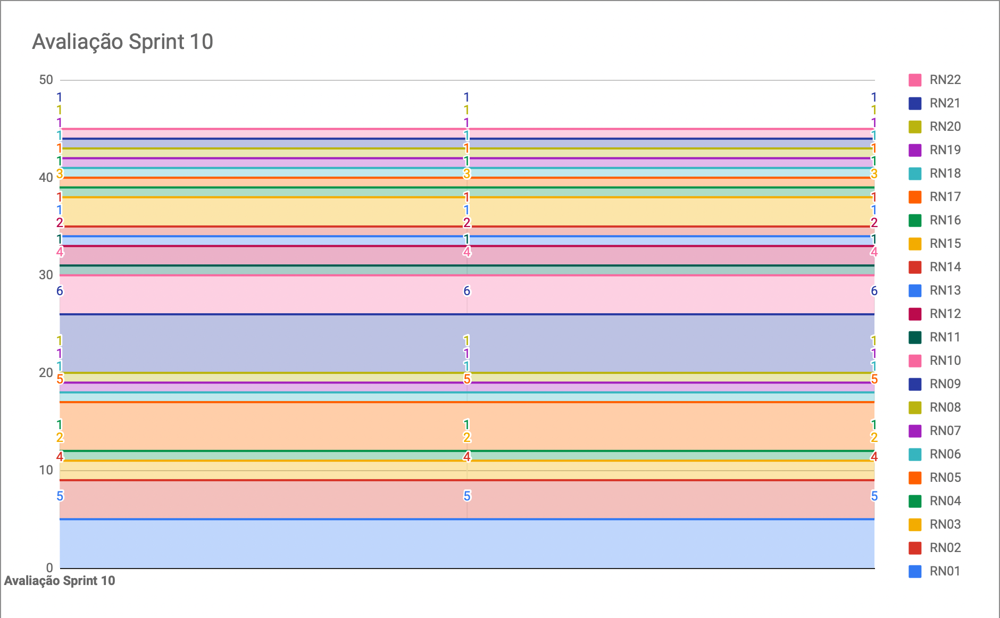
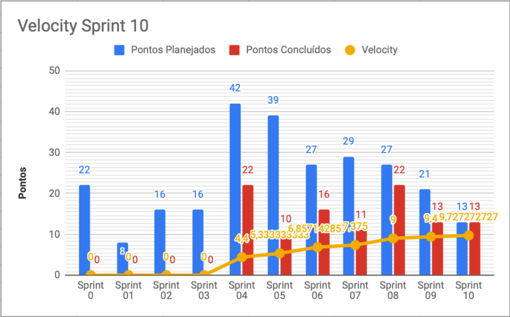

# Resultados da Sprint 10

|    Data    | Versão |         Descrição         |           Autor(es)           |
| :--------: | :----: | :-----------------------: | :---------------------------: |
| 06/11/2021 |  1.0   | Resultados da *Sprint* 10 | [Lucas Fellipe](https://github.com/lucasfcm9) |

**Data**: 06 de Novembro de 2021

**Redigida por**: Lucas Fellipe

**Participantes**: 
* Daniel Coimbra (MDS)
* Gabriel Freitas (MDS)
* Iuri Severo (EPS)
* João Pedro (EPS)
* João Victor (MDS)
* Lucas Fellipe (EPS)
* Natan Tavares (MDS)
* Paulo Henrique (MDS)

## Fechamento da Sprint

| Descrição da Tarefa                                          | Pontos |  Status   |
| ------------------------------------------------------------ | :----: | :-------: |
| [E07US01 - Eu, como pesquisador, desejo filtrar os registros, para facilitar a minha busca](https://github.com/fga-eps-mds/2021.1-Pro-Especies-Docs/issues/84) |   3    | Concluída |
| [E07US02 - Eu,como pesquisador,desejo exportar os registros para fora do aplicativo, para melhores estudos sobre os dados registrados](https://github.com/fga-eps-mds/2021.1-Pro-Especies-Docs/issues/85) |   5    | Concluída |
| [E10US01 - Eu, como usuário, desejo ver as instruções de uso do app para que consiga utilizá-lo da melhor maneira possível](https://github.com/fga-eps-mds/2021.1-Pro-Especies-Docs/issues/158) |   5    | Concluída |
| Documentar *Sprint*                                          |   0    | Concluída |
| Atualizar os documentos da *Wiki* (EVM, Riscos, *Sprints*, etc) |   0    | Concluída |
| Extrair as métricas do SonarCloud para a realização da análise no Jupyter Notebook |   0    | Concluída |
| Criar um *script* para pegar as imagens da planilha e salvar no banco de dados |   0    | Concluída |
| [*HOTFIX* - Adicionar indicador de carregamento](https://github.com/fga-eps-mds/2021.1-Pro-Especies-Docs/issues/144) |   0    | Concluída |
| [*HOTFIX* - Ordenar registros por data decrescente](https://github.com/fga-eps-mds/2021.1-Pro-Especies-Docs/issues/146) |   0    | Concluída |
| *HOTFIX* - Popular imagens dos peixes na *wiki*              |   0    | Concluída |
| [*HOTFIX* - Espaçamento na lista peixes da biblioteca](https://github.com/fga-eps-mds/2021.1-Pro-Especies-Docs/issues/147) |   0    | Concluída |
| [*HOTFIX* - Imagens na tela de listagem de biblioteca e registros não estão aparecendo](https://github.com/fga-eps-mds/2021.1-Pro-Especies-Docs/issues/148) |   0    | Concluída |
| [*HOTFIX* - Adicionar indicador de carregamento](https://github.com/fga-eps-mds/2021.1-Pro-Especies-Docs/issues/144) |   0    | Concluída |
| [*HOTFIX* - Remoção do arredondamento na foto dos peixes](https://github.com/fga-eps-mds/2021.1-Pro-Especies-Docs/issues/149) |   0    | Concluída |
| [*HOTFIX* - Remover botão de exportar para pescador e de registrar para pesquisador](https://github.com/fga-eps-mds/2021.1-Pro-Especies-Docs/issues/150) |   0    | Concluída |
| [*HOTFIX* - Grande grupo e Grupo no Registro](https://github.com/fga-eps-mds/2021.1-Pro-Especies-Docs/issues/142) |   0    | Concluída |
| [*HOTFIX* - Atualizar *checkbox* da interface](https://github.com/fga-eps-mds/2021.1-Pro-Especies-Docs/issues/159) |   0    | Concluída |
| [*HOTFIX* - Refatoração da *request* para exportação em FishLog](https://github.com/fga-eps-mds/2021.1-Pro-Especies-Docs/issues/154) |   0    | Concluída |
| [*HOTFIX* - Correção da tela de visualização de peixes e corrigir centralização](https://github.com/fga-eps-mds/2021.1-Pro-Especies-Docs/issues/145) |   0    | Concluída |
| [*HOTFIX* - Jest Reports](https://github.com/fga-eps-mds/2021.1-Pro-Especies-Docs/issues/140) |   0    | Concluída |
| [*HOTFIX* - Pipeline quebrando por não encontrar o arquivo de configuração](https://github.com/fga-eps-mds/2021.1-Pro-Especies-Docs/issues/136) |   0    | Concluída |
| [*HOTFIX* - Remoção do expiresIn da autenticação do usário](https://github.com/fga-eps-mds/2021.1-Pro-Especies-Docs/issues/138) |   0    | Concluída |

## Fechamento da Sprint

__Pontos Planejados:__ 5  
__Pontos Totais Concluídos:__ 13  
[Sprint 10](https://github.com/fga-eps-mds/2021.1-Pro-Especies-Docs/milestone/14)

## Review

* **Daniel Coimbra**: Essa semana pareou com o João Victor Batista e finalizaram a história de usuário sobre exportar registro, além da parte de salvar no aplicativo. Resolveu o *HOTFIX* de barra de carregamento. Exportar o registro agrega valor pelo fato do pesquisador conseguir exportar o dado, é uma *feature* muito importante. A barra de carregamento é positivo na experiência de usuário para mostrar ao usuário o que está acontecendo. 

* **Gabriel Freitas**: Durante a semana pareou com o Paulo. Ficaram responsáveis por realizarem o filtro dos registros. Resolveu o *HOTFIX* de tirar a opção de exportar registro do pescador. Agrega valor ao produto pois o pescador e o pesquisador vão conseguir filtrar os registros.

* **Iuri Severo**: Durante a semana mexeu no Analytics, além disso, corrigiu as métricas, arrumou os testes no *FrontEnd*, melhorou os gráficos gerados pelo Analytics e gerou as *Releases*. O Analytics mostra, de forma numérica, a qualidade do *software*. 

* **João Pedro**: Essa semana trabalhou na história de usuário nas instruções para o usuário, na primeira vez que ele usa o aplicativo. Além disso, trabalhou em diversos *HOTFIXs* (imagens, carregamento das imagens na lista dos peixes, a centralização das topbars, no espaçamento entre a lista de peixes, etc). Trabalhou no Analytics também. Agrega valor ao produto por que estamos fazendo várias correções no aplicativo que melhoram a experiência de usuário e, além disso, a instrução vai auxiliar o usuário na utilização do software. 

* **João Victor**: Essa semana pareou com o Daniel e fizeram a *issue* de exportação de registro. Isso agrega valor ao produto, pois é a etapa final onde os pesquisadores vão utilizar esses dados colhidos para os estudos. Reordenou os registros também. 

* **Lucas Fellipe**: Essa semana conseguiu atualizar todos os documentos. Atualizou todos os documentos de *Sprint*, atualizou a planilha de riscos, EVM (*Earned Value Management*) e o Velocity de cada *Sprint*. Além disso, participou na análise de métricas (Analytics), juntamente com os EPS. Agrega valor ao produto pelo fato de trazer rastreabilidade para o cliente e para as pessoas externas, para saberem o que a gente fez durante o projeto. Além disso, as métricas trazem, de forma numérica, a qualidade do produto. Riscos e EVM agregam valor ao produto pelo fato de trazer um *overview* para o cliente.

* **Natan Tavares**: Essa semana não conseguiu trabalhar muito por conta da viagem de trabalho. Começou os testes no *FrontEnd*, mas não conseguiu terminar. Hoje revisou o HOTFIX do Daniel. Terminou o HOTFIX da tela de registro, onde o usuário não estava sendo redirecionado para a home screen. Agrega valor ao produto, pois os *HOTFIXs* melhoram a experiência de usuário. 

* **Paulo Henrique**: Essa semana trabalhou em dois *HOTFIXs*. O primeiro foi sobre o alinhamento de texto, na top bar, mas não conseguiu concluir. Resolveu o *HOTFIX* de tirar a opção de exportar registro do pescador. Pareou com o Freitas para a realização da *issue* de filtro de registros. Não conseguiram finalizar. Agrega valor ao produto por que o usuário vai conseguir filtrar os registros e melhorar na experiência de usuário.

### Gráfico de BurnDown de Riscos

### Velocity

## Retrospective

* **Daniel Coimbra**
    * Positivos: A equipe foi a melhor parte, uma equipe incrível. Usar tecnologias que eu não conhecia, me tirou da minha zona de conforto, aprendi bastante. O trabalho em equipe foi sensacional, foi uma outra dinâmica. Acrescentou bastante na minha experiência;
    * Negativos: No geral, minha falta de organização. Poderia ter priorizado mais a matéria. Não deveria ter negligenciado tanto.
* **Gabriel Freitas**
    * Positivos: A equipe foi sensacional, a equipe foi a melhor parte. Todo mundo sempre prestativo, solícito. Aprendi bastante com todo mundo;
    * Negativos: Dificuldade com algumas tecnologias, mas aprendi bastante e eu só tenho a agradecer.
* **Iuri Severo**
    * Positivos: A equipe foi sensacional, a equipe foi a melhor parte. O aprendizado. É muito legal de ver o tanto que a equipe de MDS cresceu. O João Pedro como *Product Owner* foi sensacional;
    * Negativos: 3 meses para desenvolver um produto para um cliente real é bem tenso. Ficou bem corrido. 
* **João Pedro**
    * Positivos: A equipe foi sensacional, o grupo é MUITO bom. Ficamos animados com o projeto (tema) e o cliente foi muito legal. A adaptabilidade do grupo foi um ponto bem positivo. Muitas pessoas aprenderam bastante (tecnologias e teoria). O trabalho em grupo, na questão de EPS, foi um ponto bem positivo, todo mundo se disponibilizava para fazer as atividades;
    * Negativos: Mesmo tendo a questão da adaptabilidade, as mudanças causaram alguns prejuízos durante o semestre. Durante a reta final do projeto, alguns integrantes ficaram menos empenhados em realizar as tarefas. Falta de proatividade e planejamento em alguns pontos, mais especificamente, nos *HOTFIXs*. O plano de ensino causou algumas confusões nos integrantes do grupo.
* **João Victor**
    * Positivos: A equipe foi sensacional, o grupo é MUITO bom. A minha experiência com MDS foi bem tranquila. Trabalhar com vocês, uma equipe capacitada e disposta a ajudar, fez toda a diferença do mundo. A minha curva de aprendizado foi bem alta, eu aprendi bastante coisa. O cliente sempre foi bem compreensível e sempre dava *feedbacks* positivos, críticas construtivas, etc;
    * Negativos: Dificuldades que vem da matéria. Houveram algumas complicações no início do projeto. Alguns fatores que atrasaram o nosso progresso. A comunicação demorou para a equipe se engrenar.
* **Lucas Fellipe**
    * Positivos: A equipe foi sensacional, o grupo é MUITO bom. Toda a equipe foi sensacional durante o semestre. O João Pedro e o Iuri Severo fizeram bastante coisa, ajudaram bastante. Na verdade, todos os integrantes do grupo ajudaram bastante, foi uma experiência incrível. Além disso, eu aprendi bastante coisa, tanto com os EPS, quanto com os MDS e as aulas da matéria. O cliente foi muito solícito e muito tranquilo em relação à equipe, ele foi muito tranquilo;
    * Negativos: A questão da *Designer* que atrasou o nosso projeto. Perdi um pouco do ânimo durante o semestre. Falando por mim, deveria ter me organizado e priorizado melhor a matéria.
* **Natan Tavares**
    * Positivos: A equipe foi sensacional, o grupo é MUITO bom. Os grupos de MDS e EPS foram incríveis. O Iuri e o João Pedro me salvaram em diversas *issues* de programação. O projeto com o cliente real é um ponto positivo, foi uma experiência muito boa, além de ter aprendido tecnologias novas;
    * Negativos: Projeto com o cliente real, pois o semestre é muito curto para fazer um produto inteiro. A avaliação não deveria ser tão objetiva, baseado só em métricas. A matéria leva mais tempo do que deveria.
* **Paulo Henrique**
    * Positivos: A equipe foi sensacional, o grupo é MUITO bom. Quero agradecer o Natan e o Batista, por terem me ensinado tanto e serem tão pacientes. Quero agradecer ao João Pedro e ao Freitas também, me ajudaram bastante. Gostei bastante da experiência de MDS, foi incrível. Aprendi sobre a metodologia ágil;
    * Negativos: Eu comecei muito empolgado com MDS, mas meu gás foi diminuindo durante o semestre. Tive algumas dificuldades com as tecnologias. Deveria ter me pronunciado mais em relação do *BackEnd*. Procrastinei algumas vezes. 

## Quadro de Conhecimento
A equipe de EPS elaborou um quadro de conhecimento com tecnologias consideradas essenciais para o desenvolvimento do produto. É possível ter um *overview* das capacidades da equipe de desenvolvimento (MDS) e gerência (EPS).

<iframe src="https://docs.google.com/spreadsheets/d/e/2PACX-1vSHxsHZdF7aMhOiXfcXzaHDSFw3ABg2JLZFkUhKZ2YRlrnpeho33t196CHZIWyUXhRp2-MjVymqEp4a/pubhtml" width="170px" height="600px"></iframe>

## Avaliação do Scrum Master

 &emsp;&emsp;A <i>sprint</i> 10 foi bastante produtiva. Conseguimos terminar todas as US (<i>User Stories</i>) e finalizamos todos os <i>HOTFIXs</i>. Além disso, conseguimos entregar o MVP (Produto Mínimo Viável). A equipe se esforçou e se comprometeu bastante durante essa semana. Um grande parabéns para a equipe, todos são espetaculares!
