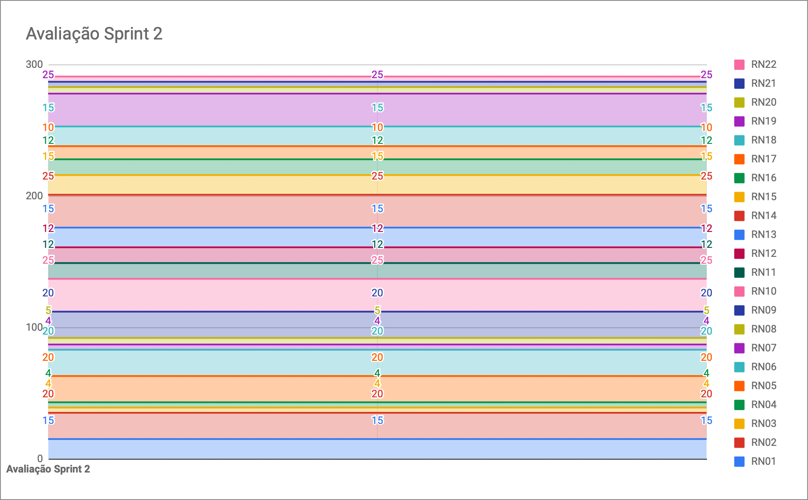

# Resultados da Sprint 2

|    Data    | Versão |         Descrição         |           Autor(es)           |
| :--------: | :----: | :-----------------------: | :---------------------------: |
| 13/09/2021 |  1.0   | Resultados da *Sprint* 2 | [Lucas Fellipe](https://github.com/lucasfcm9) |

**Data**: 13 de Setembro de 2021

**Redigida por**: Lucas Fellipe

**Participantes**: 
* Gabriel Freitas (MDS)
* Iuri Severo (EPS)
* João Pedro (EPS)
* Lucas Fellipe (EPS)
* Natan Tavares (MDS)
* João Victor (MDS)
* Paulo Henrique (MDS)
* Pedro Rodrigues (EPS)

## Fechamento da Sprint

| Issue | Pontos | Status | Observação |
| ----- | :----: | :----: | ----- |
| [E03US01 - Eu, como usuário desejo visualizar informações de um peixe na wiki, a fim de facilitar o reconhecimento de espécies](https://github.com/fga-eps-mds/2021.1-Pro-Especies-Docs/issues/77) | 8 | Não Concluída | Foi realizada apenas no *BackEnd*, devido a falta de um Protótipo de Alta Fidelidade |
| [Elaborar GQM (*Goal Question Metric*)](https://github.com/fga-eps-mds/2021.1-Pro-Especies-Docs/issues/111) | 0 | Concluída | - |
| [Testes no repositório do *FishWiki*](https://github.com/fga-eps-mds/2021.1-Pro-Especies-Docs/issues/108) | 0 | Concluída | - |
| [Coleta de dados do *SonarCloud*](https://github.com/fga-eps-mds/2021.1-Pro-Especies-Docs/issues/93) | 0 | Concluída | - |
| [Refatoração de documentos](https://github.com/fga-eps-mds/2021.1-Pro-Especies-Docs/issues/90) | 0 | Concluída | - |
| [Testes no repositório de Registros](https://github.com/fga-eps-mds/2021.1-Pro-Especies-Docs/issues/95) | 0 | Concluída | - |
| [Testes no projeto de *Flutter*](https://github.com/fga-eps-mds/2021.1-Pro-Especies-Docs/issues/106) | 0 | Concluída | Não foi realizada devido a mudança arquitetural |
| [Testes no repositório de Usuários](https://github.com/fga-eps-mds/2021.1-Pro-Especies-Docs/issues/94) | 0 | Não Concluída | - |
| [Configurar *Lint* do *Flutter*](https://github.com/fga-eps-mds/2021.1-Pro-Especies-Docs/issues/89) | 0 | Não Concluída | Não foi realizada devido a mudança arquitetural |
| [Configurar *CodeCov* nos serviços](https://github.com/fga-eps-mds/2021.1-Pro-Especies-Docs/issues/109) | 0 | Concluída | Foi realizadas, porém, colocamos toda a cobertura de testes no próprio *SonarCloud* |
| [Atualizar main dos repositórios](https://github.com/fga-eps-mds/2021.1-Pro-Especies-Docs/issues/91) | 0 | Concluída | - |
| [Documentar Fechamento da *Sprint* 1 e Abertura da *Sprint* 2](https://github.com/fga-eps-mds/2021.1-Pro-Especies-Docs/issues/126) | 0 | Concluída | - |

__Pontos Planejados:__ 8  
__Pontos Totais Concluídos:__ 0  
[Milestone Sprint 2](https://github.com/fga-eps-mds/2021.1-Pro-Especies-Docs/milestone/6?closed=1)

## Review

* **Daniel Coimbra**: Trabalhou juntos com o Freitas na *issue* da *Wiki*. Fizeram a parte do *BackEnd*, além da parte dos Testes. Tiveram dificuldades na parte da elaboração dos testes. Os testes agregam valor ao produto pelo fato de mostrar que a aplicação está funcionando.

* **Gabriel Freitas**: Essa semana pareou com o Daniel. Fizeram o CRUD da *Wiki*. Não conseguiram concluir a parte dos testes. Agrega valor ao produto pelo fato da *Wiki* ser uma das principais partes do aplicativo. 

* **Iuri Severo**: Essa semana refatorou o documento de arquitetura, principalmente o diagrama de classes. Elaborou o GQM. Ajudou no CI da *Release* e do *Coverage*. Todos esses pontos agregam valor ao produto. O Diagrama de Classes mostra o que o cliente espera do projeto. O GQM ajuda a garantir a qualidade do produto. O *Coverage* diminui o risco humano na execução da aplicação.

* **João Pedro**: Essa semana fez bastante coisa. Mexeu no *Backlog* junto com o Iuri Severo. Além disso, mexeu na questão do *Coverage*. Criou o novo serviço, do *UserInterface* com *React Native* e *TypeScript*. Refatorou o Diagrama de Pacotes e da arquitetura (alterou para *React Native*). Ajudou os MDS com os testes. Isso traz bastante valor ao nosso produto pelo fato de estarmos mostrando a qualidade do código para outras pessoas. Além disso, esses outros pontos agregam valor ao produto. O Diagrama de Pacotes mostra o que o cliente espera do projeto. O *Coverage* diminui o risco humano na execução da aplicação.

* **João Victor**: Essa semana pareou com o Natan. Fizeram os testes nos repositórios de *User* e do *FishLog*. O teste é a prova física pois mostra que o código está funcionando e tem qualidade. 

* **Lucas Fellipe**: Essa semana trabalhou na refatoração da EVM (*Earned Value Management*), além de criar toda a documentação de Riscos. Ajudou no CI do *Coverage* e documentou as *Sprints*. A EVM agrega valor ao produto pelo fato de mostrar ao cliente o que a equipe está agregando ao produto em relação ao que foi planejado. Além disso, o *Coverage auxilia e assegura a qualidade de código. A documentação das *Sprints* agregam valor ao produto por trazer rastreabilidade o tempo todo em relação ao que a equipe está realizando. 

* **Natan Tavares**: Elaborou as *issues* de teste do repositório de *User* e do *FishLog*. Teve bastante dificuldade com os testes. Agrega valor ao produto pelo fato dos testes assegurarem uma qualidade para o cliente, além de segurança. 

* **Paulo Henrique**: Estudou sobre a API do *Dropbox* e começou a fazer os testes do *FrontEnd*. Ficou com dificuldades na hora de testar. Adquiriu conhecimento estudando e realizando os testes. O *Dropbox* é importante pelo fato de ser a única forma de acessar os dados dos peixes, além de ser uma API bem segura para guardar os dados. 

* **Pedro Rodrigues**: Essa *Sprint* não conseguiu contribuir bastante. Criou o repositório da *Wiki*. Conseguiu realizar o CI da *Release*. Agrega valor ao produto pelo fato de mostrar o que a gente está fazendo, deixando o cliente confiante pelo fato de estarmos mostrando o que estamos fazendo. 

### Gráfico de BurnDown de Riscos

## Retrospective

* **Daniel Coimbra**
    * Positivos: Recebeu ajuda de bastante gente para a elaboração dos testes;
    * Negativos: Está com um pouco de dificuldade em *TypeScript*;
    * Melhorias: Estudar mais sobre *TypeScript* e melhorar a comunicação. Entender mais o que está acontecendo no projeto.
* **Gabriel Freitas**
    * Positivos: Aprendeu mais sobre *TypeScript* e pareou com os meninos. Sentiu uma evolução no aprendizado;
    * Negativos: Teve dificuldades com testes em *TypeScript* e teve dificuldades em relação a comunicação; 
    * Melhorias: Aprender testes e não tentar resolver tudo sozinho.
* **Iuri Severo**
    * Positivos: Definimos a questão d@ *Designer*. Definimos a tecnologia do *FrontEnd*. Os testes deram certo e ficamos com a cobertura boa em todos os repositórios. A *Release* funcionou. Vamos entregar tudo;
    * Negativos: *SonarFlutter* precisar de um servidor próprio. A dificuldade em passar o *Coverage* para o *SonarCloud*;
    * Melhorias: Comunicação geral. 
* **João Pedro**
    * Positivos: O trabalho do time em geral, todo mundo se esforçando para realizar as atividades. A definição d@ *Designer*, agora sabemos o que temos que seguir. O trabalho em grupo, pelo fato de todo mundo estar se ajudando.;
    * Negativos: A definição d@ *Designer*, foi uma definição tardia. Falar mais sobre as dificuldades;
    * Melhorias: Comunicação geral.
* **João Victor**
    * Positivos: Entregar a minha *issue*. O trabalho em equipe pois todo mundo está se ajudando;
    * Negativos: A dificuldade em testes;
    * Melhorias: Melhorar a minha comunicação em relação a passar o conhecimento.
* **Lucas Fellipe**
    * Positivos: O trabalho do time está muito bom, todos estão bem comprometidos com o projeto. A definição d@ *Designer* e a realização dos testes assegurando qualidade do produto;
    * Negativos: A definição d@ *Designer*, pelo fato de ter sido uma definição tardia. Além disso, a timidez dos integrantes da equipe em relação ao que está acontecendo no projeto;
    * Melhorias: Melhorar a comunicação da equipe como um todo e, falando por mim, melhorar a minha organização e não deixar tudo para última hora.
* **Natan Tavares**
    * Positivos: Aprendeu bastante sobre testes. Teve bastante ajuda do João Pedro e do Brian;
    * Negativos: Semana passada estava com alguns problemas pessoais e ficou com dificuldade em fazer as coisas;
    * Melhorias: Nenhuma, por enquanto.
* **Paulo Henrique**
    * Positivos: Teve uma maior responsabilidade pelo fato de estar sozinho durante a *Sprint*. Conseguiu se virar sozinho fazendo as *issues*;
    * Negativos: Timidez em relação a pedir ajuda para os outros membros da equipe;
    * Melhorias: Nenhuma, por enquanto.
* **Pedro Rodrigues**
    * Positivos: O trabalho em grupo foi muito bom. Toda *Sprint* eu tenho orgulho de todo mundo. Os testes estarem prontos e com uma cobertura muito alta. A definição d@ *Designer*;
    * Negativos: A dificuldade em separar as US (*User Stories*) e, falando por mim, não consegui desenvolver bastante coisa;
    * Melhorias: A comunicação geral.

## Quadro de Conhecimento
A equipe de EPS elaborou um quadro de conhecimento com tecnologias consideradas essenciais para o desenvolvimento do produto. É possível ter um *overview* das capacidades da equipe de desenvolvimento (MDS) e gerência (EPS).

<iframe src="https://docs.google.com/spreadsheets/d/e/2PACX-1vSHxsHZdF7aMhOiXfcXzaHDSFw3ABg2JLZFkUhKZ2YRlrnpeho33t196CHZIWyUXhRp2-MjVymqEp4a/pubhtml" width="170px" height="600px"></iframe>

## Avaliação do Scrum Master

 &emsp;&emsp;A <i>sprint</i> 2 teve um grande êxito e teve mais tempo de duração, apesar da correria pelo fato da entrega da R1. A equipe está bem comprometida e a comunicação está constante. Além disso, a maioria das US (<i>User Stories</i>) foram entregues, todos os testes foram realizados e a cobertura está acima de 80% em todos os serviços. A entrega da R1 foi realizada com sucesso com todos os documentos feitos, além das métricas do <i>SonarCloud</i> e das <i>Releases</i>.

