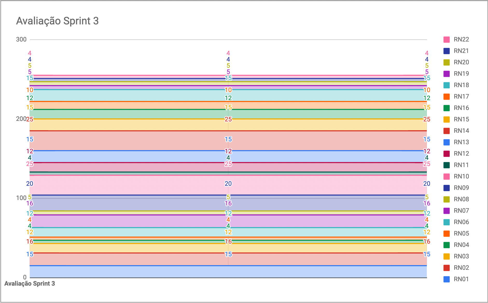

# Resultados da Sprint 3

|    Data    | Versão |         Descrição         |           Autor(es)           |
| :--------: | :----: | :-----------------------: | :---------------------------: |
| 18/09/2021 |  1.0   | Resultados da *Sprint* 3 | [Lucas Fellipe](https://github.com/lucasfcm9) |

**Data**: 18 de Setembro de 2021

**Redigida por**: Lucas Fellipe

**Participantes**: 
* Gabriel Freitas (MDS)
* Iuri Severo (EPS)
* João Pedro (EPS)
* Lucas Fellipe (EPS)
* Natan Tavares (MDS)
* João Victor (MDS)
* Paulo Henrique (MDS)
* Pedro Rodrigues (EPS)

## Fechamento da Sprint

| Issue | Pontos | Status | Observação |
| ----- | :----: | :----: | :----: |
| [ES07US01 - Eu, como pesquisador, desejo filtrar os registros, para facilitar a minha busca](https://github.com/fga-eps-mds/2021.1-Pro-Especies-Docs/issues/84) | 3 | Não Concluída | Foi realizada apenas no *BackEnd*, devido a falta de um Protótipo de Alta Fidelidade |
| [E07US02 - Eu, como pesquisador, desejo exportar os registros para fora do aplicativo, para melhores estudos sobre os dados registrados](https://github.com/fga-eps-mds/2021.1-Pro-Especies-Docs/issues/85) | 5 | Não Concluída | Foi realizada apenas no *BackEnd*, devido a falta de um Protótipo de Alta Fidelidade |
| [ES03US02 - Eu, como usuário, desejo receber dados dinamicamente da planilha dos pesquisadores, a fim de visualizar dados dos peixes na wiki](https://github.com/fga-eps-mds/2021.1-Pro-Especies-Docs/issues/76) | 8 | Não Concluída | - |
| [Preparação e apresentação do *Dojo* de *React Native*](https://github.com/fga-eps-mds/2021.1-Pro-Especies-Docs/issues/120) | 0 | Concluída | - |
| [HOTFIX - Refatoração das *models* do Serviço de Registro](https://github.com/fga-eps-mds/2021.1-Pro-Especies-Docs/issues/117) | 0 | Concluída | - |
| [HOTFIX - Retorno de Dados no Cadastro](https://github.com/fga-eps-mds/2021.1-Pro-Especies-Docs/issues/116) | 0 | Concluída | - |
| [Documentar Fechamento da Sprint 2 e Abertura da Sprint 3](https://github.com/fga-eps-mds/2021.1-Pro-Especies-Docs/issues/122) | 0 | Concluída | - |

__Pontos Planejados:__ 16  
__Pontos Totais Concluídos:__ 0  
[Milestone Sprint 3](https://github.com/fga-eps-mds/2021.1-Pro-Especies-Docs/milestone/7)

## Review

* **Daniel Coimbra**: Essa semana estudou sobre *Jest* e ainda está com dificuldades. Nenhum valor ao produto.

* **Gabriel Freitas**: Essa semana fechou uma *issue* com o Natan Tavares, mas falta o *FrontEnd*. Isso agrega valor ao produto pelo fato da filtragem dos relatórios no aplicativo.

* **Iuri Severo**: Essa semana corrigiu o CI para gerar a *Release* certa. Além disso, participou e editou o vídeo da apresentação e ajudou o João Victor com a API do *Dropbox*. A apresentação agrega valor pelo fato de facilitar o acompanhamento do desenvolvimento do produto.

* **João Pedro**: Essa semana focou na entrega da *Release* 1. Começou a estudar sobre *React Native*. Começou a elaborar a identidade visual (UI/UX). Próxima semana teremos o *FrontEnd* e isso agrega bastante valor ao produto, pois agora vamos ter uma interface, além de fecharmos nossas US (*User Stories*).

* **João Victor**: Essa semana fez a *issue* de filtrar a *wiki* e a de realizar a atualização da *wiki* pela API do *Dropbox*. Filtrar a *wiki* facilita a experiência do usuário e atualizar a *wiki* é essencial para a funcionalidade da *wiki*, agregando conhecimento ao usuário.

* **Lucas Fellipe**: Essa semana focou na entrega da *Release* 1, além de documentar as *Sprints*. Participou da apresentação da *Release 1* para o cliente. As *Sprints* agregam valor pelo fato de mostrar o que a equipe está fazendo (rastreabilidade) e a apresentação gera valor pelo fato de dar um *overview* sobre o que está acontecendo no projeto.

* **Natan Tavares**: Essa semana mexeu em um dos HOTFIX do usuário, além de mexer na *issue* de filtragem do registro por *status*, mas não terminaram e a de exportar os relatórios. Agrega valor ao usuário e a questão do HOTFIX traz segurança para o nosso produto.

* **Paulo Henrique**: 

* **Pedro Rodrigues**: Fez revisões nas *Releases* e adicionei as metricas extraídas do *SonarCloud* nos *assets*. Agrega valor ao produto pois é uma forma de catalogar e demonstrar nosso trabalho.

### Gráfico de BurnDown de Riscos

## Retrospective

* **Daniel Coimbra**
    * Positivos: A equipe de EPS está sempre disposta a ajudar;
    * Negativos: Está faltando disponibilidade da minha parte em comparecer nos pareamentos para a realização das *issues*;
    * Melhorias: Fazer o que tem que ser feito na hora certa e parear.
* **Gabriel Freitas**
    * Positivos: O meu esforço e o esforço do Natan Tavares na realização das *issues*. Compartilhamento de informações na hora do pareamento;
    * Negativos: Nenhum, por enquanto;
    * Melhorias: Não perder tanto tempo lendo documentação e tentar fazer mais.
* **Iuri Severo**
    * Positivos: O João Pedro, pelo fato dele fazer uma IDV muito boa;
    * Negativos: A entrega foi um fato negativo, pelo fato da organização. Falta compromisso da equipe na hora de realização das tarefas;
    * Melhorias: Organização das tarefas, para termos uma *sprint* mais bem definida. 
* **João Pedro**
    * Positivos: A nossa apresentação foi muito boa, além da nossa entrega. Muita proatividade dos MDS, principalmente do Natan Tavares, do João Victor e do Gabriel Freitas. Começar a ter o planejamento do *FrontEnd* para a próxima *Sprint*;
    * Negativos: A questão da organização, foi muito bagunçada essa *Sprint*;
    * Melhorias: Melhorar a organização. 
* **João Victor**
    * Positivos: A nossa apresentação foi um ponto bem positivo, todos apresentaram muito bem. Aprendeu bastante coisa nessa semana com os pareamentos. Os EPS estão sempre disponíveis para tirar dúvidas;
    * Negativos: A comunicação de MDS foi bem ruim, pecamos nessa área;
    * Melhorias: Organização e, falando por mim, tomar iniciativa.
* **Lucas Fellipe**
    * Positivos: A nossa apresentação foi muito boa, todos os integrantes da equipe apresentaram muito bem. Além disso, todos os integrantes continuam trabalhando muito bem;
    * Negativos: A organização dessa *Sprint* foi bem ruim, pecamos em alguns fatores. Além disso, a comunicação não foi das melhores;
    * Melhorias: Melhorar a organização para a próxima *Sprint* e melhorar a comunicação.
* **Natan Tavares**
    * Positivos: A minha comunicação com o Gabriel Freitas foi bem positiva, pareamos bastante. A disponibilidade dos EPS;
    * Negativos: A *Sprint* ter começado na segunda foi bem ruim, pelo fato de termos perdido um dia de trabalho. Pecamos na área de detalhamento da *issue* de exportação;
    * Melhorias: Detalhar melhor os requisitos.
* **Paulo Henrique**
    * Positivos: 
    * Negativos: 
    * Melhorias: 
* **Pedro Rodrigues**
    * Positivos: Conseguimos realizar a entrega da *Release* 1 e a apresentação da mesma para o cliente. Além disso, conseguimos trocar a tecnologia para o RN, evitando o risco do *Flutter* com o *SonarCloud*;
    * Negativos: Tive que me ausentar metade da semana para uma viagem de emergência;
    * Melhorias: Nenhuma, por enquanto.

## Quadro de Conhecimento
A equipe de EPS elaborou um quadro de conhecimento com tecnologias consideradas essenciais para o desenvolvimento do produto. É possível ter um *overview* das capacidades da equipe de desenvolvimento (MDS) e gerência (EPS).

<iframe src="https://docs.google.com/spreadsheets/d/e/2PACX-1vSHxsHZdF7aMhOiXfcXzaHDSFw3ABg2JLZFkUhKZ2YRlrnpeho33t196CHZIWyUXhRp2-MjVymqEp4a/pubhtml" width="170px" height="600px"></iframe>

## Avaliação do Scrum Master
A *sprint* 3 foi um pouco conturbada, pelo fato de termos pecado na organização. Porém, conseguimos entregar a maioria das *issues*. Além disso, todos os integrantes participaram da apresentação da *Release* 1 para o cliente, que foi uma excelente apresentação. Um ponto muito importante a ser ressaltado é o fato de todos os integrantes estarem bem proativos para a realização das tarefas.
