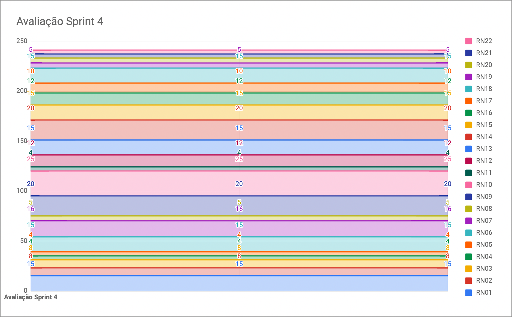

# Resultados da Sprint 4

|    Data    | Versão |         Descrição         |           Autor(es)           |
| :--------: | :----: | :-----------------------: | :---------------------------: |
| 25/09/2021 |  1.0   | Resultados da *Sprint* 4 | [Lucas Fellipe](https://github.com/lucasfcm9) |

**Data**: 25 de Setembro de 2021

**Redigida por**: Lucas Fellipe

**Participantes**: 
* Gabriel Freitas (MDS)
* Iuri Severo (EPS)
* João Pedro (EPS)
* Lucas Fellipe (EPS)
* Natan Tavares (MDS)
* João Victor (MDS)
* Paulo Henrique (MDS)
* Pedro Rodrigues (EPS)

## Fechamento da Sprint

| Issue | Pontos | Status | Observação |
| ----- | :----: | :----: | :----: |
| [E01US04 - Eu, como usuário, desejo acessar tela inicial do aplicativo para que eu possa começar a navegar pelo aplicativo](https://github.com/fga-eps-mds/2021.1-Pro-Especies-Docs/issues/86) | 3 | Não Concluída | Não foi concluída pelo fato de ainda não termos um *Deploy* |
| [Realizar a refatoração de todos os documentos da Wiki](https://github.com/fga-eps-mds/2021.1-Pro-Especies-Docs/issues/125) | | Concluída | - |
| [Elaborar a Identidade Visual do Aplicativo](https://github.com/fga-eps-mds/2021.1-Pro-Especies-Docs/issues/118) | 0 | Concluída |  |
| [Estudar plataformas para fazer deploy dos serviços](https://github.com/fga-eps-mds/2021.1-Pro-Especies-Docs/issues/124) | 0 | Concluída | - |
| [Criação da primeira versão do protótipo de alta fidelidade](https://github.com/fga-eps-mds/2021.1-Pro-Especies-Docs/issues/119) | 0 | Concluída | - |
| [E01US01 - Eu, como usuário, desejo poder me cadastrar na plataforma para poder realizar registro e coleta de dados sobre peixes](https://github.com/fga-eps-mds/2021.1-Pro-Especies-Docs/issues/43) | 8 | Não Concluída | Não foi concluída pelo fato de ainda não termos um *Deploy* |
| [E01US02 - Eu, como usuário, desejo acessar minha conta na plataforma para poder realizar registro e coleta de dados sobre peixes](https://github.com/fga-eps-mds/2021.1-Pro-Especies-Docs/issues/45) | 5 | Não Concluída | Não foi concluída pelo fato de ainda não termos um *Deploy* |
| [E01US03 - Eu, como usuário, desejo ser autenticado pelo aplicativo para poder realizar registro e coleta de dados sobre peixes](https://github.com/fga-eps-mds/2021.1-Pro-Especies-Docs/issues/46) | 5 | Não Concluída | Não foi concluída pelo fato de ainda não termos um *Deploy* |
| [E03US01 - Eu, como usuário, desejo visualizar informações de um peixe na *wiki*, a fim de facilitar o reconhecimento de espécies](https://github.com/fga-eps-mds/2021.1-Pro-Especies-Docs/issues/77) | 8 | Não Concluída | Não foi concluída pelo fato de ainda não termos um *Deploy* |
| [E03US02 - Eu, como usuário, desejo receber dados dinamicamente da planilha dos pesquisadores, a fim de visualizar dados de peixes na *wiki*](https://github.com/fga-eps-mds/2021.1-Pro-Especies-Docs/issues/76) | 8 | Não Concluída | Não foi concluída pelo fato de ainda não termos um *Deploy* |
| [E07US02 - Eu,como pesquisador,desejo exportar os registros para fora do aplicativo, para melhores estudos sobre os dados registrados](https://github.com/fga-eps-mds/2021.1-Pro-Especies-Docs/issues/85) | 5 | Não Concluída | Não foi concluída pelo fato de ainda não termos um *Deploy* |

__Pontos Planejados:__ 42  
__Pontos Totais Concluídos:__ 0  
[Milestone Sprint 4](https://github.com/fga-eps-mds/2021.1-Pro-Especies-Docs/milestone/8)

## Review

* **Daniel Coimbra**: Essa *sprint* trabalhou na tela de cadastro e na integração da API do registro de usuário. Agrega valor ao produto, pois sem uma conta, o usuário não consegue realizar a maioria das funcionalidades, então é uma parte bem importante do produto.

* **Gabriel Freitas**: Essa *sprint* pareou com o Paulo Henrique e com o João Victor. Fez a conexão da tela de informação de um peixe com a API. Isso agrega valor ao produto pelo fato de você conseguir pegar as informações de um peixe.

* **Iuri Severo**: Essa semana pesquisou sobre o *Deploy*. Elaborou o manual de identidade visual. Agrega valor ao produto pois a identidade visual representa a marca de uma forma mais geral. 

* **João Pedro**: Essa semana ficou focado no *dojo* de *React Native*, além de ter organizado e aplicado. Além disso, ficou super focado no protótipo de alta fidelidade. Terminou o curso de UI/UX e aplicou tudo no protótipo. Isso agrega valor, primeiro de tudo, pois temos uma base para desenvolver o *FrontEnd*. Isso agrega muito valor ao cliente pois ele consegue ver como vai ficar o aplicativo e, também, gera muito valor para a gente por que sabemos o que vamos desenvolver. E o *React Native* agrega valor pois agora conseguimos codificar um *FrontEnd*.

* **João Victor**: Essa semana pareou com o Paulo Henrique e com o Gabriel Freitas. Fizeram a tela inicial do aplicativo e já aplicaram o sistema de navegação. Fizeram a tela de visualização de um peixe na *Wiki*. A tela inicial agrega valor ao produto, pois é a partir dela que todos os usuários vão conseguir acessar todas as funcionalidades do aplicativo e a questão da tela de informação do peixe agrega valor pois é a forma que temos de disseminar o conhecimento a respeito dos peixes para os usuários.

* **Lucas Fellipe**: Essa semana atualizou todos os documentos de *Sprint* e alguns outros documentos, como o de Custos e o de Riscos. Conversamos com o Hilmer sobre a questão da pontuação das US (*User Stories*). Isso agrega valor ao produto pois fornece um *Overview* do que a equipe está realizando, o que estamos agregando de valor ao produto, literalmente.

* **Natan Tavares**: Essa semana trabalhou junto com o Daniel na *issue* de registro. Isso agrega valor ao produto pois é um dos requisitos principais que é criar conta para usar o aplicativo.

* **Paulo Henrique**: Nessa *Sprint* pareou com o Gabriel Freitas e com o João Victor. Nessa *Sprint* tivemos que resolver duas *issues*. Resolvemos a *issue* de mostrar os dados de um peixe e da tela inicial.

* **Pedro Rodrigues**: Estudou os documentos de *deploy* que o Iuri tinha levantado. Está tentando achar uma tecnologia que possamos usar de forma gratuita. Além disso, participou da reunião com o cliente para mostrar a identidade visual do aplicativo.

### Gráfico de BurnDown

### Velocity

### Gráfico de BurnDown de Riscos

## Retrospective

 &emsp;&emsp;A Retrospecitva da <i>Sprint</i> foi um pouco diferente dessa vez. Fizemos em uma plataforma chamada MetroRetro e foi comandada pelo Pedro Rodrigues. Foi uma dinâmica bem legal e os principais pontos que levantamos foram os seguintes:

*O que devemos começar a fazer*:
- Melhorar a organização;
- Distribuir melhor o fluxo de trabalho durante a semana;
- Balancear o número de *commits* dentro de um pareamento;
- Agendar os pareamentos desde o início da *Sprint*;
- Comunicar mais/melhor com o time;
- Todos os EPS revisarem os *Pull Requests*;
- Estudar mais *React Native* para conseguir revisar os *Pull Requests*;
- Sempre tentar pesquisar alternativas antes de começar o código em si;
- Ter mais momentos de descontração;
- Mais comprometimento com o projeto;
- Dailies mais cedo na Sexta-Feira.

*O que devemos parar de fazer*:
- Parar de sermos fechados em relação a comunicação;
- Deixar tudo para o final da *Sprint*;
- Dívidas deixadas de lado;
- Pessoas sobrecarregadas/Má distribuição das tarefas;
- *Pull Requests* revisados no Sábado;
- Monopolização dos *commits* de uma *issue*;
- Programar sem pareamento;
- Pedir ajuda para pessoas externas;
- Devemos parar de chamar tanto os EPS para ajudar nas *issues*;

*O que devemos continuar fazendo*:
- Marcar os pareamentos com antecedência;
- Pareamentos onde todos codificam;
- Paciência e Empatia;
- Todos ensinam muito bem;
- Companheirismo da equipe;
- Manter o apoio entre os integrantes da equipe;
- Iuri e João Pedro Guedes ajudando bastante os MDS nos problemas das *issues*;
- Falar sobre os impedimentos da *Daily*;
- Tarefas sendo cumpridas;
- Telas sendo feitas no *FrontEnd*;
- Entrega das atividades;
- Proatividade da equipe;
- Protótipo de Alta Fidelidade finalizado. Parabéns ao João Pedro Guedes;
- A comunicação melhorou nessa *Sprint*;

*Ações que devem ser realizadas para que haja uma melhora dentro da equipe*:
- Olhar a disponibilidade dos integrantes para marcar os pareamentos, para que se tenha uma melhor organização e divisão das tarefas;
- *Dailies* 18h na Sexta-Feira;
- Mudar o Assignee para o novo pareamento;
- Guardiões do *CodeBase*: Um EPS fica responsável por um repositório para revisar os *Pull Requests*;
- Reuniões toda Segunda-Feira para debater sobre as *issues* e elicitar formas de resolução;
- Sempre antes de iniciar alguma ação durante a *Sprint*, comunicar no grupo de MDS/EPS o que pretende fazer naquele momento;
- Ao enfrentar um problema, seguir os seguintes passos: Documentação, *Google* e só depois pedir ajuda para os EPS ou pessoas externas.

## Quadro de Conhecimento
A equipe de EPS elaborou um quadro de conhecimento com tecnologias consideradas essenciais para o desenvolvimento do produto. É possível ter um *overview* das capacidades da equipe de desenvolvimento (MDS) e gerência (EPS).

<iframe src="https://docs.google.com/spreadsheets/d/e/2PACX-1vSHxsHZdF7aMhOiXfcXzaHDSFw3ABg2JLZFkUhKZ2YRlrnpeho33t196CHZIWyUXhRp2-MjVymqEp4a/pubhtml" width="170px" height="600px"></iframe>

## Avaliação do Scrum Master

 &emsp;&emsp;A <i>sprint</i> 4 foi muito boa, apesar de ser uma semana bem atarefada. As entregas dessa semana começaram bem tarde, mas conseguimos desenvolver todas as telas do <i>FrontEnd</i>, o que significa que os MDS se adaptaram bem a nova tecnologia. Além disso, vimos que temos que aplicar algumas melhorias dentro da equipe, pois alguns membros estão sobrecarregados. Ainda não possuímos nenhuma História de Usuário completa, o que é um pouco complicado devido aos riscos que passamos. Mas já temos muitas coisas feitas e, a partir de agora, devemos recuperar as energias para entregarmos o nosso MVP nas próximas semanas.

