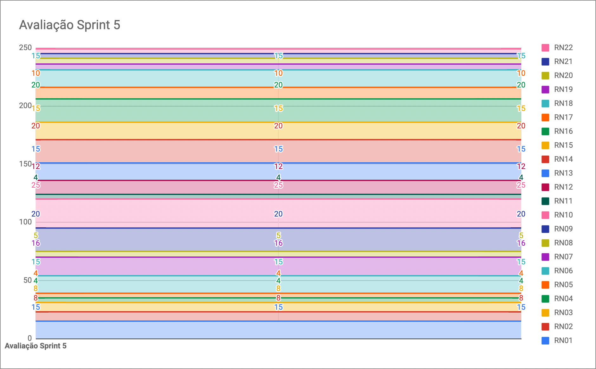
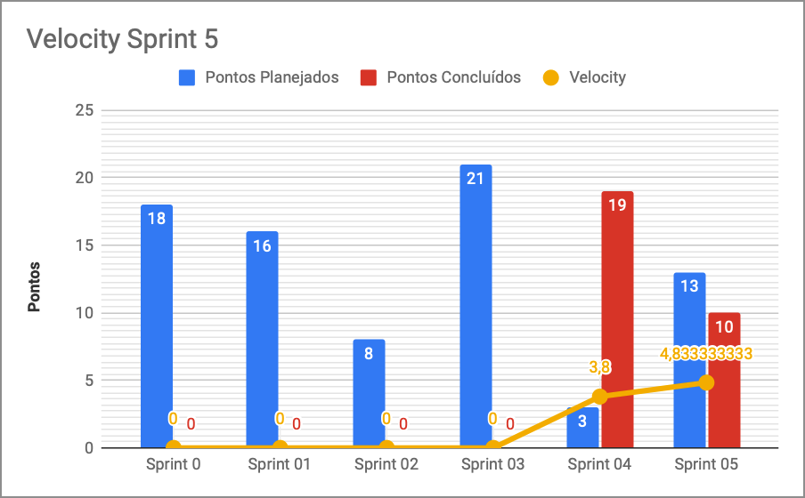

# Resultados da Sprint 5

|    Data    | Versão |         Descrição         |           Autor(es)           |
| :--------: | :----: | :-----------------------: | :---------------------------: |
| 02/10/2021 |  1.0   | Resultados da *Sprint* 5 | [Lucas Fellipe](https://github.com/lucasfcm9) |

**Data**: 02 de Outubro de 2021

**Redigida por**: Lucas Fellipe

**Participantes**: 
* Gabriel Freitas (MDS)
* Iuri Severo (EPS)
* João Pedro (EPS)
* Lucas Fellipe (EPS)
* Natan Tavares (MDS)
* João Victor (MDS)
* Paulo Henrique (MDS)
* Pedro Rodrigues (EPS)

## Fechamento da Sprint

| Issue | Pontos | Status | Observação |
| ----- | :----: | :----: | :----: |
| [E02US01 - Eu, como usuário, desejo criar um registro de peixes para o servidor, a fim de realizar a coleta de dados](https://github.com/fga-eps-mds/2021.1-Pro-Especies-Docs/issues/60) | 8 | Não Concluída | - |
| [E01US02 - Eu, como usuário, desejo acessar minha conta na plataforma para poder realizar registro e coleta de dados sobre peixes](https://github.com/fga-eps-mds/2021.1-Pro-Especies-Docs/issues/45) | 5 | Concluída | - |
| [E01US03 - Eu, como usuário, desejo ser autenticado pelo aplicativo para poder realizar registro e coleta de dados sobre peixes](https://github.com/fga-eps-mds/2021.1-Pro-Especies-Docs/issues/46) | 5 | Concluída | - |
| [E03US02 - Eu, como usuário, desejo receber dados dinamicamente da planilha dos pesquisadores, a fim de visualizar dados de peixes na *wiki*](https://github.com/fga-eps-mds/2021.1-Pro-Especies-Docs/issues/76) | 8 | Não Concluída | - |
| [E03US03 - Eu, como usuário, desejo pesquisar peixes na wiki para ter um acesso mais fácil às informações sobre peixes específicos](https://github.com/fga-eps-mds/2021.1-Pro-Especies-Docs/issues/79) | 8 | Não Concluída | - |
| [E03US05 - Eu, como usuário, desejo poder visualizar todos os peixes da wiki a fim de facilitar o reconhecimento de espécies](https://github.com/fga-eps-mds/2021.1-Pro-Especies-Docs/issues/127) | 5 | Não Concluída | - |
| [Realizar *deploy* dos serviços](https://github.com/fga-eps-mds/2021.1-Pro-Especies-Docs/issues/128) | 0 | Não Concluída | - |

__Pontos Planejados:__ 13  
__Pontos Totais Concluídos:__ 10  
[Milestone Sprint 5](https://github.com/fga-eps-mds/2021.1-Pro-Especies-Docs/milestone/9)

## Review

* **Daniel Coimbra**: Essa semana pareou com o João Victor Batista e fizeram as *issues* de contexto de *storage* do *token* e a autenticação das rotas. Isso agrega valor ao produto pois são as funcionalidades padrões e precisam dessa autenticação.

* **Gabriel Freitas**: Essa semana ficou com a parte de criar um novo registro de peixe. Criou a tela e só falta terminar algumas coisas básicas. A tela de registro é muito importante para quem é pesquisador, pois ajuda bastante na coleta de novos dados.

* **Iuri Severo**: Não conseguiu fazer nada pelo fato de estar sem computador devido a alguns problemas.

* **João Pedro**: Essa *Sprint* ficou focado no CI e no CD do *FrontEnd*. Encontrou alguns problemas e vai validar com o Hilmer. Por enquanto, não está pronto. Não agregou nada de valor ao produto ainda.

* **João Victor**: Essa *Sprint* pareou com o Daniel Coimbra. Cuidaram da parte de fazer a tela de *login* e da autenticação de usuário. Isso agrega valor ao produto pois, a partir do login, o usuário vai acessar as funcionalidades do aplicativo e a autenticação vai trazer uma questão de segurança para o usuário.

* **Lucas Fellipe**: Essa *Sprint* não conseguiu contribuir com bastante coisa. Mas, atualizou os documentos de *Sprint*, de custos e de riscos. Isso agrega valor ao produto pelo fato de trazer bastante rastreabilidade para o cliente, para ele saber o que a equipe está realizando naquele momento/semana.

* **Natan Tavares**: Essa semana foi um pouco complicada, mas organizou várias coisas. Mexeu na *issue* da *Wiki*. Não conseguiu entregar ela ainda pelo fato dos testes, ou seja, está bem complicado. Não está pronto, mas agrega valor pelo fato da *Wiki* ser um dos requisitos principais do aplicativo. 

* **Paulo Henrique**: Essa semana pareou algumas vezes com o Natan Tavares. Fizeram a *issue* do *Dropbox* de pegar os dados da planilha. Adiantou algumas coisas do *FrontEnd*. Já adiantou bastante coisa mas não conseguiu finalizar. Está com um pouco de dificuldade com a tecnologia. Agrega valor ao produto pois os usuários vão conseguir visualizar a *wiki* de peixes com a planilha sempre atualizada.

* **Pedro Rodrigues**: Essa semana só mexeu com o *Deploy*. Conseguiu realizar o *deploy* de apenas um serviço. Isso agrega valor ao produto pois vamos definir como os usuários vão ter acesso ao nosso aplicativo.

### Gráfico de BurnDown

### Velocity

### Gráfico de BurnDown de Riscos

### Velocity

## Retrospective

 &emsp;&emsp;A Retrospecitva da <i>Sprint</i> realizada na plataforma chamada MetroRetro novamente. Foi uma dinâmica bem legal e os principais pontos que levantamos foram os seguintes:

*O que devemos começar a fazer*:
- Falar as dificuldades nas *dailies* mesmo estando em fase de pesquisa;
- Falar sobre os impedimentos na *daily*;
- Os MDS revisarem os *Pull Requests* de documentos;
- Melhorar a organização pessoal;
- Atualizar planilha de horários e confirmar disponibilidade nos horários marcados;
- Informar com antecedência quando não conseguir ir nas reuniões marcadas;
- Dar mais atenção a matéria de MDS/EPS;
- Iniciativa para resolver os problemas que surgirem;
- Mais comprometimento com as reuniões, principalmente nas *dailies*.

*O que devemos parar de fazer*:

- Atrasar para as *dailies*;
- Não ter medo e se sentir inseguro com as funcionalidades novas;
- Evitar sobrecargas;
- Parar de procrastinar.

*O que devemos continuar fazendo*:

- A maioria das ações da retrospectiva da semana passada tiveram boas mudanças;
- Reuniões na Segunda-Feira às 18h;
- Proatividade dos membros da equipe;
- Apoio entre os membros da equipe;
- Comunicação mais ativa entre os pareamentos;
- Comunicação com pareamento;
- Continuar mantendo o pareamento;
- Alinhamento do andamento das *issues*;
- Divisão de tarefas entre pares quando os horários não batem;
- Marcar os horários dos pareamentos.

*Ações que devem ser realizadas para que haja uma melhora dentro da equipe*:

- Ser mais detalhado nas *dailies* e falar mais sobre os impedimentos;
- Os MDS revisarem os *Pull Requests* do repositório de documentos;
- Ao fim de cada *Sprint Review*, revisar o quadro de horários;
- Informar com antecedência ausências em reuniões;
- Ter mais compromisso com a matéria de EPS/MDS;
- Escrever a ata se faltar a reunião;
- Melhorar a organização pessoal e garantir uma carga compatível a sua força atual;
- *Baby Steps* (Um passo de cada vez);
- Anotar as ideias.

## Quadro de Conhecimento
A equipe de EPS elaborou um quadro de conhecimento com tecnologias consideradas essenciais para o desenvolvimento do produto. É possível ter um *overview* das capacidades da equipe de desenvolvimento (MDS) e gerência (EPS).

<iframe src="https://docs.google.com/spreadsheets/d/e/2PACX-1vSHxsHZdF7aMhOiXfcXzaHDSFw3ABg2JLZFkUhKZ2YRlrnpeho33t196CHZIWyUXhRp2-MjVymqEp4a/pubhtml" width="170px" height="600px"></iframe>

## Avaliação do Scrum Master

 &emsp;&emsp;A <i>sprint</i> 5 foi muito boa, apesar de ser uma semana bem atarefada e com algumas dificuldades e impedimentos. Além disso, conseguimos aplicar todas as ações que propusemos na retrospectiva da <i>sprint</i> passada, mas ainda precisamos continuar melhorando a cada dia. Ainda não possuímos nenhuma História de Usuário completa, o que é um ruim devido aos riscos que passamos. Mas já temos muitas coisas feitas e, a partir de agora, devemos focar para a entrega do MVP.

