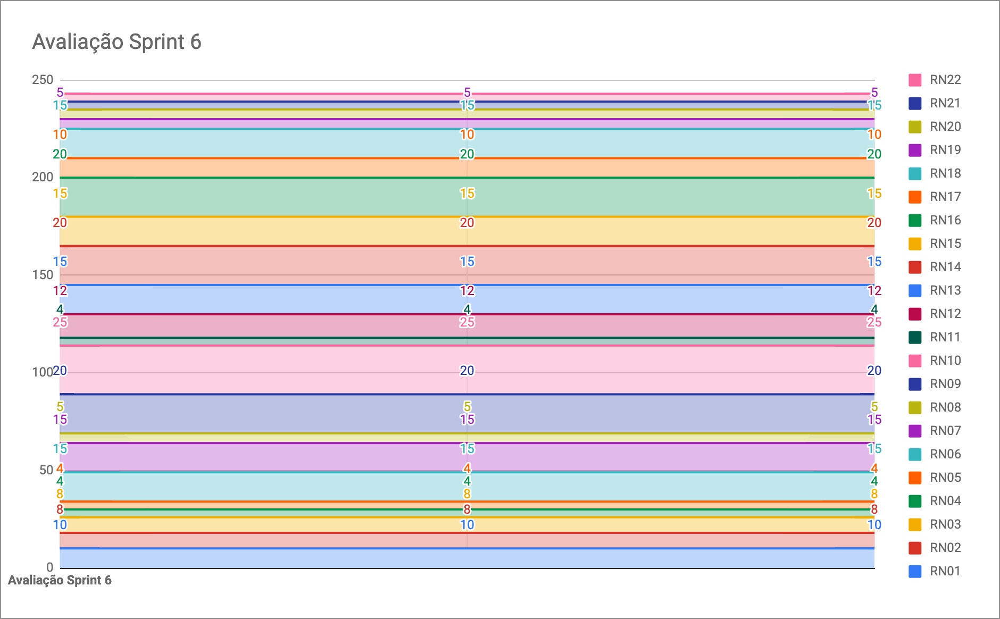

# Resultados da Sprint 6

|    Data    | Versão |         Descrição         |           Autor(es)           |
| :--------: | :----: | :-----------------------: | :---------------------------: |
| 09/10/2021 |  1.0   | Resultados da *Sprint* 6 | [Gabriel Freitas](https://github.com/gabrielfreitass1) |
| 11/10/2021 |  1.1   | Atualização do Documento, Atualização da tabela de Fechamento da *Sprint*, Adição do gráfico de *Burndown* de Riscos e Atualização do *Review* da *Sprint* | [Lucas Fellipe](https://github.com/lucasfcm9) |

**Data**: 09 de Outubro de 2021

**Redigida por**: Gabriel Freitas

**Participantes**: 
* Gabriel Freitas (MDS)
* Iuri Severo (EPS)
* João Pedro (EPS)
* Lucas Fellipe (EPS)
* João Victor (MDS)
* Paulo Henrique (MDS)
* Pedro Rodrigues (EPS)

## Fechamento da Sprint

| Issue | Pontos | Status | Observação |
| ----- | :----: | :----: | :----: |
| [E02US01 - Eu, como usuário, desejo criar um registro de peixes para o servidor, a fim de realizar a coleta de dados](https://github.com/fga-eps-mds/2021.1-Pro-Especies-Docs/issues/60) | 8 | Não Concluída | Não foi concluída pelo fato de ainda não termos um *Deploy* |
| [E03US03 - Eu, como usuário, desejo pesquisar peixes na wiki para ter um acesso mais fácil às informações sobre peixes específicos](https://github.com/fga-eps-mds/2021.1-Pro-Especies-Docs/issues/79) | 8 | Não Concluída | Não foi concluída pelo fato de ainda não termos um *Deploy* |
| [E03US05 - Eu, como usuário, desejo poder visualizar todos os peixes da wiki a fim de facilitar o reconhecimento de espécies](https://github.com/fga-eps-mds/2021.1-Pro-Especies-Docs/issues/127) | 5 | Não Concluída | Não foi concluída pelo fato de ainda não termos um *Deploy* |
| [E04US02 - Eu, como usuário, desejo acessar o histórico dos registros que enviei, para revistá-los e checar seus status](https://github.com/fga-eps-mds/2021.1-Pro-Especies-Docs/issues/81) | 3 | Não Concluída | Não foi concluída pelo fato de ainda não termos um *Deploy* |
| [E04US01 - Eu, como usuário, desejo acessar a página do meu perfil no app, para ter acesso aos dados referentes a minha conta](https://github.com/fga-eps-mds/2021.1-Pro-Especies-Docs/issues/80) | 3 | Não Concluída | Não foi concluída pelo fato de ainda não termos um *Deploy* |

__Pontos Planejados:__ 27  
__Pontos Totais Concluídos:__ 0  
[Milestone Sprint 6](https://github.com/fga-eps-mds/2021.1-Pro-Especies-Docs/milestone/10)

## Review

* **Daniel Coimbra**: Essa semana foi bastante desafiadora. Pegou uma *Sprint* sozinho e ficou de terminar a página de histórico de registros, além da componentização. Além disso, vai terminar a página de registros. Isso agrega valor ao produto porque o pesquisador precisa visualizar os registros.

* **Gabriel Freitas**: Essa semana ficou com a *issue* de criação de registros e da biblioteca de peixes. Fez as funções da câmera para a criação de registros e os primeiros passos com a conexão da API, além de ter pareado com o Paulo algumas vezes para estilizar a *Wiki*. Isso gera valor ao produto pelo fato dos pescadores conseguirem criar registros para os pesquisadores e pelo conhecimento e estudo fornecido proveniente da biblioteca de peixes.

* **Iuri Severo**:Essa sprint terminou o manual de identidade visual e iniciou a integração contínua de interface com o João Pedro.A identidade visual agrega valor ao produto porque ela padroniza a estilização do aplicativo. 

* **João Pedro**: Essa semana ficou responsável pelo CI/CD, que está praticamente finalizado. Isso agrega valor ao produto porque, a partir de agora, será possível gerar um APK (*Android Package*) para o usuário/cliente testar.

* **João Victor**: Essa semana pareou com o Natan Tavares e ficaram responsáveis pelas telas de visualizar o registro e pesquisar os peixes na biblioteca. Isso agrega valor ao produto, porque vendo um registro, o pesquisador pode visualizar erros ou exportá-los. Quanto a pesquisar na *Wiki*, ajuda o usuário a identificar um peixe e ajudar no seu aprendizado.

* **Lucas Fellipe**: Essa semana fez documento de *Sprint* novamente e começou a atualizar a EVM (*Earned Value Management*). Agrega valor ao produto pois, a partir dos documentos de *Sprint*, os usuários e o cliente conseguem visualizar o que a equipe está elaborando em alguma semana específica, ou seja, traz rastreabilidade para o projeto. A EVM mostra os custos que o cliente está tendo até o momento com o produto.

* **Paulo Henrique**: Pareou com o Paulo Henrique e prosseguiu com a *issue* atrasada da biblioteca de peixes. Foi um esforço muito grande, mas aos poucos foi dando certo.Agrega valor ao produto porque o usuário vai conseguir visualizar a lista de peixes cadastrados.

* **Pedro Rodrigues**: Essa semana subiu o ambiente de produção e ainda não conseguiu concluiu o CD de *Deploy* de serviço para o *Heroku*. Agrega valor ao produto, pois conseguimos gerar o APK e mostrar todo o nosso esforço para o cliente.

### Gráfico de BurnDown

### Velocity

### Gráfico de BurnDown de Riscos

## Retrospective

 &emsp;&emsp;A Retrospecitva da <i>Sprint</i> realizada na plataforma chamada MetroRetro. Foi uma dinâmica bem legal e os principais pontos que levantamos foram os seguintes:

*O que está nos atrasando?*:
- Falta de afinidade com a tecnologia;
- Dificuldade com estilização;
- Dificuldade com a tecnologia;
- Má organização pessoal;
- Desmotivação;
- Problemas com o computador pessoal;
- Falta de foco quando se tem mais de 1 *issue*;
- *Issues* realizadas com apenas 1 pessoa quando se tem algum conteúdo novo;
- Falta de equilíbrio nos pareamentos;
- Falta de senso de pareamento;
- Desânimo;
- Organização da *Sprint*;
- Dependência de dívidas;
- Falta de conhecimento do *Scrum*, User Stories e Integração Contínua.

*O que está nos levando para frente?*:

- O semestre está acabando;
- Pokémon pré/pós reunião;
- Organização das tarefas que vão ser adicionadas considerando as pendências;
- Comunicação boa durante e entre as *Sprints*;
- Troca de informações;
- As reuniões de Segunda-Feira sobre as *issues*;
- Melhorar as qualidades como desenvolvedor;
- Aprendizado de programação e projeto;
- Membros bem capacitados;
- Paciência com os integrantes e o aprendizado passado;
- Trabalho em equipe;
- Excelente grupo;
- Alinhamento da equipe;
- Empenho.

*Ações que devem ser realizadas para que haja uma melhora dentro da equipe*:

- *Atravessar a ponte*. Estudar a documentação, praticar e um esforço extra;
- Focar em apenas 1 *issue* antes de prosseguir para a outra;
- Os pareamentos serem elaborados de acordo com a capacidade de cada membro;
- Realizar uma *Sprint* pare resolver todas as pendências;
- Rever o horário da reunião de Segunda-Feira.

## Quadro de Conhecimento
A equipe de EPS elaborou um quadro de conhecimento com tecnologias consideradas essenciais para o desenvolvimento do produto. É possível ter um *overview* das capacidades da equipe de desenvolvimento (MDS) e gerência (EPS).

<iframe src="https://docs.google.com/spreadsheets/d/e/2PACX-1vSHxsHZdF7aMhOiXfcXzaHDSFw3ABg2JLZFkUhKZ2YRlrnpeho33t196CHZIWyUXhRp2-MjVymqEp4a/pubhtml" width="170px" height="600px"></iframe>

## Avaliação do Scrum Master

 &emsp;&emsp;A <i>sprint</i> 6 foi um pouco desorganizada. Precisamos rever alguns problemas que estamos tendo e aplicar as ações que definimos durante a reunião de sábado. Além disso, estamos avançando com as histórias de usuário e com a documentação. Todos os membros são proativos e, além disso, todos estão empenhados em entregar as <i>issues</i>. Algumas ações, de <i>sprints</i> passadas já foram aplicadas e estamos melhorando a cada dia. A entrega do MVP está próxima, então precisamos manter o foco.

