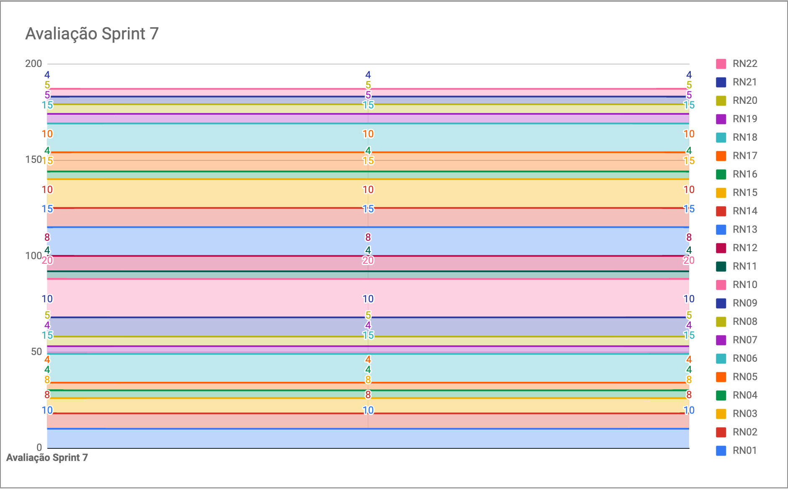
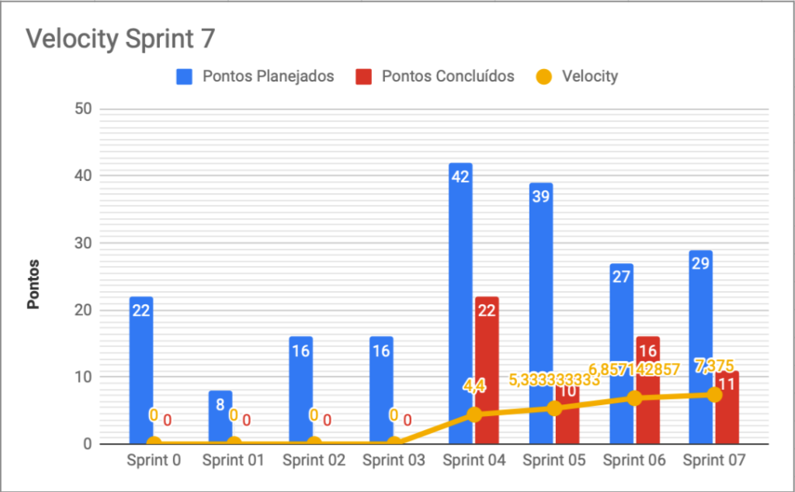

# Resultados da Sprint 7

|    Data    | Versão |         Descrição         |           Autor(es)           |
| :--------: | :----: | :-----------------------: | :---------------------------: |
| 16/10/2021 |  1.0   | Resultados da *Sprint* 7 | [Lucas Fellipe](https://github.com/lucasfcm9) |

**Data**: 16 de Outubro de 2021

**Redigida por**: Lucas Fellipe

**Participantes**: 
* Gabriel Freitas (MDS)
* Iuri Severo (EPS)
* João Pedro (EPS)
* Lucas Fellipe (EPS)
* João Victor (MDS)
* Paulo Henrique (MDS)
* Pedro Rodrigues (EPS)

## Fechamento da Sprint

| Issue | Pontos | Status | Observação |
| ----- | :----: | :----: | :----: |
| [E02US01 - Eu, como usuário, desejo criar um registro de peixes para o servidor, a fim de realizar a coleta de dados](https://github.com/fga-eps-mds/2021.1-Pro-Especies-Docs/issues/60) | 8 | Concluída | - |
| [E03US02 - Eu, como usuário, desejo receber dados dinamicamente da planilha dos pesquisadores, a fim de visualizar dados de peixes na wiki](https://github.com/fga-eps-mds/2021.1-Pro-Especies-Docs/issues/76) | 8 | Não Concluída | - |
| [E03US04 - Eu como usuário, desejo filtrar os peixes afim de encontrar o peixe com mais facilidade](https://github.com/fga-eps-mds/2021.1-Pro-Especies-Docs/issues/121) | 5 | Não Concluída | - |
| [E04US01 - Eu, como usuário, desejo acessar o histórico dos registros que enviei, para revistá-los e checar seus status](https://github.com/fga-eps-mds/2021.1-Pro-Especies-Docs/issues/81) | 3 | Concluída | - |
| [E06US01 - Eu, como usuário, desejo editar ou remover dados do registro, a fim de aumentar a confiabilidade da coleta de dados](https://github.com/fga-eps-mds/2021.1-Pro-Especies-Docs/issues/62) | 5 | Não Concluída |  |
| [Configurar Integração Contínua no repositório UserInterface](https://github.com/fga-eps-mds/2021.1-Pro-Especies-Docs/issues/130) | 0 | Concluída | - |
| [Realizar deploy dos serviços](https://github.com/fga-eps-mds/2021.1-Pro-Especies-Docs/issues/128) | 0 | Concluída | - |
| Documentar *Sprint* | 0 | Concluída | - |

__Pontos Planejados:__ 0  
__Pontos Totais Concluídos:__ 11  
[Milestone Sprint 7](https://github.com/fga-eps-mds/2021.1-Pro-Especies-Docs/milestone/11)

## Review

* **Daniel Coimbra**: Essa semana pareou com o Natan Tavares para a realização das *issues* de editar/remover registro e da visualização dos registros. Não conseguiram terminar as duas *issues*. Agrega valor ao produto pelo fato de mostrar os registros do usuário e na edição e remoção dos registros. 

* **Gabriel Freitas**: Essa semana pareou com o João Victor Batista e resolveram a dívida técnica da tela de registro. A tela de filtro está quase toda estilizada, faltam apenas as *checkboxs*. A tela de registro agrega bastante valor pelo fato dos pesquisadores conseguirem a identificar novas espécies. 

* **João Pedro**: Essa semana ficou focado no CI e no CD no *FrontEnd*. Estamos gerando um novo APK a cada Pull Request. Estamos fazendo a entrega contínua. Agrega valor pelo fato de estarmos gerando um novo aplicativo (APK) para que o cliente possa testar as novas funcionalidades implementadas. 

* **João Victor**: Pareou com o Gabriel Freitas e ficaram responsáveis por resolverem a *issue* que estava atrasada. Não conseguiram terminar a *issue* de filtro. É a principal funcionalidade do aplicativo pelo fato de possibilitar a criação de novos registros para o levantamente de informações, por isso agrega bastante valor ao produto.

* **Lucas Fellipe**: Essa semana refatorou algumas coisas da EVM (*Earned Value Management*). Ajudou o Paulo a popular os dados da planilha no banco de dados e documentou a *Sprint*. Agrega valor ao produto pela questão de rastreabilidade para o cliente saber o que estamos desenvolvendo.

* **Natan Tavares**: Essa semana ficou responsável pela *issue* que estava atrasada juntamente com o Daniel Coimbra. Fizeram as *issue* de meus registros e de editar/remover um registro. Agrega valor ao produto por que são requisitos que levantamos para o aplicativo.

* **Paulo Henrique**: Essa semana ficou responsável por popular os dados da planilha e salvar no banco de dados. Já está quase finalizando. Agrega valor ao produto pelo fato de dar informações para os pescadores e pesquisadores. 

* **Pedro Rodrigues**: Essa semana só conseguiu mexer no *deploy* dos serviços. Conseguiu ajudar algumas outras pessoas e não mexeu com nada concreto que tenha valor para o produto.

### Gráfico de BurnDown de Riscos

### Velocity

## Retrospective

* **Daniel Coimbra**
    * Positivos: Conseguiu fazer parte da mesma *issue* da *Sprint* passada. Conseguiu manter a cabeça no mesmo contexto. Além disso, a ajuda do João Pedro e do Iuri Severo. O pareamente com o Natan foi ótimo também;
    * Negativos: No meu caso, poderia ter levado o início da semana de forma mais séria;
    * Melhorias: Melhorar a consistência.
* **Gabriel Freitas**
    * Positivos: Conseguiu entregar a *issue* que estava atrasada há 3 semanas;
    * Negativos: Minha comunicação com o João Victor foi um pouco ruim. Falta de organização pessoal;
    * Melhorias: Organização pessoal. Preciso sentar e me organizar melhor.
* **João Pedro**
    * Positivos: Entregar a primeira versão do aplicativo para os clientes. Agregamos bastante valor nesse quesito. Meu pareamento com o Iuri foi um ponto bastante positivo;
    * Negativos: Organização da equipe e organização pessoal de cada um. Tivemos muitas histórias que não foram finalizadas. Temos dificuldade em falar os impedimentos na *daily*;
    * Melhorias: Organização geral. Justificar por que faltou alguma reunião.
* **João Victor**
    * Positivos: Trabalho em equipe, como sempre;
    * Negativos: A comunicação com o Gabriel Freitas foi um pouco ruim. Nossos horários são conflitantes;
    * Melhorias: Pensar caso a caso na distribuição das *issues* durante a semana.
* **Lucas Fellipe**
    * Positivos: Trabalho em equipe e a entrega do APK para o Oscar e para a Mariana;
    * Negativos: Organização pessoal e falta de tempo;
    * Melhorias: Me organizar melhor durante a semana e conseguir mais tempo para estar mais presente no projeto.
* **Natan Tavares**
    * Positivos: Essa semana conseguiu mexer mais em *React Native* do que na última semana. Aprendeu bastante. Minha comunicação com o Daniel foi bastante boa;
    * Negativos: A *issue* atrasada que tinha para fazer. Tinha muita coisa e acabou atrasando a outra *issue*;
    * Melhorias: Nenhuma, por enquanto.
* **Paulo Henrique**
    * Positivos: Gostou de ter ficado com uma *issue* do *BackEnd*;
    * Negativos: Ter dúvidas e não saber como se expressar, não ter clareza na hora de falar;
    * Melhorias: Está muito preso em pedir ajuda para o João Pedro Guedes, preciso melhorar essa característica.
* **Pedro Rodrigues**
    * Positivos: Foi uma semana complicada por alguns outros motivos, mas estou bem melhor;
    * Negativos: Falta de tempo;
    * Melhorias: Tentar organizar melhor o meu tempo para estar mais presente no projeto.

## Quadro de Conhecimento
A equipe de EPS elaborou um quadro de conhecimento com tecnologias consideradas essenciais para o desenvolvimento do produto. É possível ter um *overview* das capacidades da equipe de desenvolvimento (MDS) e gerência (EPS).

<iframe src="https://docs.google.com/spreadsheets/d/e/2PACX-1vSHxsHZdF7aMhOiXfcXzaHDSFw3ABg2JLZFkUhKZ2YRlrnpeho33t196CHZIWyUXhRp2-MjVymqEp4a/pubhtml" width="170px" height="600px"></iframe>

## Avaliação do Scrum Master

 &emsp;&emsp;A <i>Sprint</i> 7 foi um boa, os membros continuam empenhados. O João Pedro e o Iuri estão sendo peças fundamentais para o projeto e para a entrega das atividades. Além disso, não estamos conseguindo entregar as histórias de usuário planejadas para a <i>Sprint</i>, pelo fato de não estarmos bem organizados. Estamos com problemas em falar os impedimentos na <i>daily</i>, sendo que, se falássemos, poderíamos resolver as <i>issues</i> de forma mais rápida. Entretanto, conseguimos entregar o APK para o Oscar e para a Mariana, o que é um ponto bastante positivo, pois agora temos os <i>feedbacks</i> dos clientes. Precisamos melhorar a organização da equipe para entregarmos todas as histórias de usuário.
