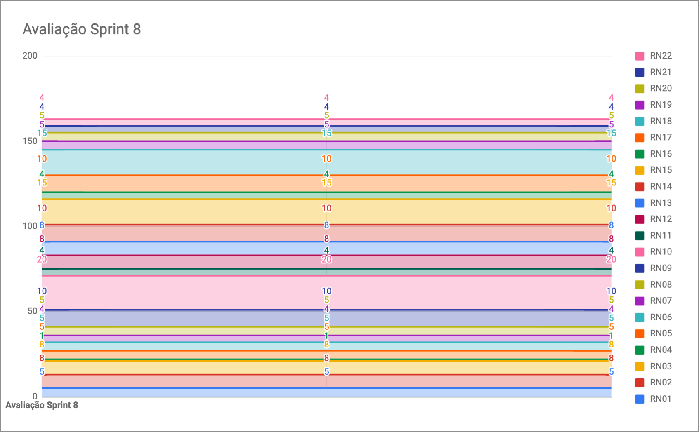
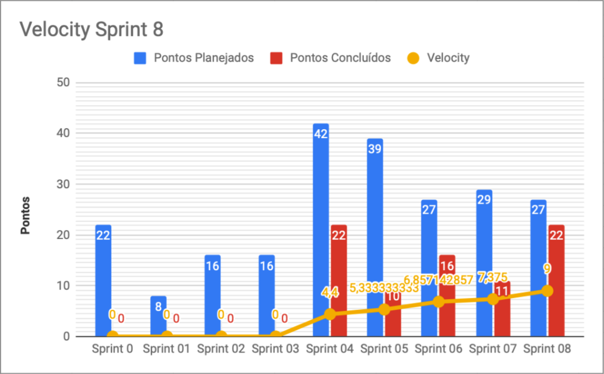

# Resultados da Sprint 8

|    Data    | Versão |         Descrição         |           Autor(es)           |
| :--------: | :----: | :-----------------------: | :---------------------------: |
| 23/10/2021 |  1.0   | Resultados da *Sprint* 8 | [Lucas Fellipe](https://github.com/lucasfcm9) |

**Data**: 18 de Setembro de 2021

**Redigida por**: Lucas Fellipe

**Participantes**: 
* Daniel Coimbra (MDS)
* Gabriel Freitas (MDS)
* Iuri Severo (EPS)
* João Pedro (EPS)
* Lucas Fellipe (EPS)
* Natan Tavares (MDS)
* Paulo Henrique (MDS)
* Pedro Rodrigues (EPS)

## Fechamento da Sprint

| Issue                                                        | Pontos |    Status     | Observação |
| ------------------------------------------------------------ | :----: | :-----------: | :--------: |
| [E03US02 - Eu, como usuário, desejo receber dados dinamicamente da planilha dos pesquisadores, a fim de visualizar dados de peixes na wiki](https://github.com/fga-eps-mds/2021.1-Pro-Especies-Docs/issues/76) |   8    |   Concluída   |     -      |
| [E03US04 - Eu como usuário, desejo filtrar os peixes afim de encontrar o peixe com mais facilidade](https://github.com/fga-eps-mds/2021.1-Pro-Especies-Docs/issues/121) |   5    | Não Concluída |     -      |
| [E05US01 - Eu, como usuário, me beneficiaria de peixes pré-cadastrados, para facilitar a montagem de registros](https://github.com/fga-eps-mds/2021.1-Pro-Especies-Docs/issues/82) |   3    |   Concluída   |     -      |
| [E06US01 - Eu, como usuário, desejo editar ou remover dados do registro, a fim de aumentar a confiabilidade da coleta de dados](https://github.com/fga-eps-mds/2021.1-Pro-Especies-Docs/issues/62) |   5    |   Concluída   |     -      |
| Documentar *Sprint*                                          |    0    |             Concluída              |      -      |
| [E08US01 - Eu, como usuário, desejo acessar o mapa da minha localização no cadastro de registro, a fim de realizar o registro para coleta de dados](https://github.com/fga-eps-mds/2021.1-Pro-Especies-Docs/issues/63) |   3    |   Concluída   |     -       |
| [E08US02 - Eu, como usuário, desejo salvar minha localização marcada no mapa, a fim de ajudar na coleta de dados](https://github.com/fga-eps-mds/2021.1-Pro-Especies-Docs/issues/71) |   3    |   Concluída   |     -      |

## Fechamento da Sprint

__Pontos Planejados:__ 9  
__Pontos Totais Concluídos:__ 22  
[Milestone Sprint 8](https://github.com/fga-eps-mds/2021.1-Pro-Especies-Docs/milestone/12)

## Review

* **Daniel Coimbra**: Trabalhou juntamente com o João Victor Batista e com o Paulo Henrique nas *issues* de filtro e a de seleção de peixes pré-cadastrados. Isso agrega na experiência de usuário, pois ajuda o usuário a escolher mais rápido os peixes.

* **Gabriel Freitas**: Essa semana trabalhou na *issue* de editar/remover um registro e na aprovação do registro. Agrega bastante valor ao produto para quem é pesquisador, pois agora eles conseguem identificar novas espécies, além de atualizar os dados de uma espécie já existente. 

* **Iuri Severo**: Essa semana pareou com o João Pedro Guedes na realização de 2 *issues*. Agrega valor ao produto pelo fato do mapeamento das espécies em extinção, pelo fato da localização ser essencial para o aplicativo.

* **João Pedro**: Essa semana ficou trabalhando nas duas US voltadas para o mapa. Já é possível pegar a localização do usuário, além de marcar a localização que ele quiser no mapa. Resolveu alguns bugs e reconfigurou todo o *EXPO*. Além disso, ajudou os integrantes de MDS. Agrega valor ao produto pelo fato do mapeamento das espécies em extinção, onde essa é uma das principais funcionalidades do aplicatvo. Essa questão da localização é essencial para o aplicativo. 

* **Lucas Fellipe**: Essa semana ficou responsável pela *issue* de popular os dados da planilha no banco de dados juntamente com o Pedro Rodrigues. Participou da reunião com a Infra e documentou as *Sprints*. A população dos dados agrega valor por trazer mais conhecimento e informações para os pescadores e pesquisadores, pois agora vamos ter uma *Wiki* populada. A documentação agrega valor pelo fato da rastreabilidade. 

* **Natan Tavares**: Essa semana trabalhou na *issue* de editar e remover registros. Revisou o PR (*Pull Request*) do João Pedro. Agrega valor ao produto pelo fato de ser um dos principais requisitos para o pesquisador, que permite ele revisar os registros e tudo mais.

* **Paulo Henrique**: Essa semana ficou responsável pela visualização dos peixes pré-cadastrados. Mexeu com os filtros. Pareou com o Batista e com o Daniel. Resolveu conflitos do PR que o Batista abriu, além de fazer alguns *HOTFIXs*. Essas atividades agregam valor ao produto por trazer mais credibilidade ao usuário. As *issues* trazem valor por trazer mais informações sobre os peixes e de forma mais rápida.

* **Pedro Rodrigues**: Essa semana ficou com a *issue* junto com o Lucas para popular os dados. Participou da reunião da infra para saber como ia funcionar o projeto pós-disciplina. Está fazendo o documento de *deploy*. Agrega valor ao produto pelo fato de integrar as pessoas externas com o produto.

### Gráfico de BurnDown de Riscos

### Velocity

## Retrospective

*Quais são os nossos super poderes?*:
- João Pedro Guedes é um herói para a nossa equipe;
- Trabalho em equipe excelente;
- Disposição dos membros para ajudar;
- Empenho do time;
- MDS e EPS seguem com bom entrosamento;
- Comprometimento do time com o projeto;
- Nossas entregas possuem bastante qualidade;
- Os prazos estão sendo cumpridos;
- Comunicação boa entre os pareamentos;
- Troca de informação e conhecimento;
- Comunicação ativa tanto pelo discord quanto pelo telegram;
- Reunião às 18h na Segunda-Feira bastante importante;
- Quantidade de *issues* certas para cada pareamento;
- Pareamentos marcados com antecedência.

*Quais são as nossas fraquezas*:

- Algumas *issues* estão atrasadas;
- Às vezes acontecem algumas falhas na comunicação;
- Focar em muita coisa de uma vez só;
- Organização;
- Má priorização das tarefas em execução. 

*De quem precisamos como nosso ajudante?*:

- Atualização dos *cards* no *ZenHub*;
- Ficar atento aos *Pull Request's* abertos e aos comentários feitos nesses *Pull Request's*;
- Revisar as mensagens do Hilmer;
- Validação dos *StakeHolders*.

*Ações que devem ser realizadas para que haja uma melhora dentro da equipe*:

- Atualizar os *cards* do *ZenHub*;
- Ficar atento aos *Pull Request's* abertos e aos comentários feitos nesses *Pull Request's*;
- Deixar claro para os clientes a importância dos *feedbacks*;
- Revisar as mensagens do Hilmer;

## Quadro de Conhecimento
A equipe de EPS elaborou um quadro de conhecimento com tecnologias consideradas essenciais para o desenvolvimento do produto. É possível ter um *overview* das capacidades da equipe de desenvolvimento (MDS) e gerência (EPS).

<iframe src="https://docs.google.com/spreadsheets/d/e/2PACX-1vSHxsHZdF7aMhOiXfcXzaHDSFw3ABg2JLZFkUhKZ2YRlrnpeho33t196CHZIWyUXhRp2-MjVymqEp4a/pubhtml" width="170px" height="600px"></iframe>

## Avaliação do Scrum Master

 &emsp;&emsp;A <i>sprint</i> 8 foi bastante produtiva. Só não entregamos 1 US, o que significa que a equipe está empenhanda e trabalhando bastante. Estamos quase finalizando todas as US para a entrega do MVP, o que é um ponto bem positivo. Além disso, precisamos reorganizar alguns documentos e revisar algumas mensagens do professor para que possamos entregar o melhor produto para os nossos clientes. Essa semana os EPS tiveram que codificar, para que houvesse uma maior entrega de US por *Sprint*. Estou orgulhoso dessa equipe!
