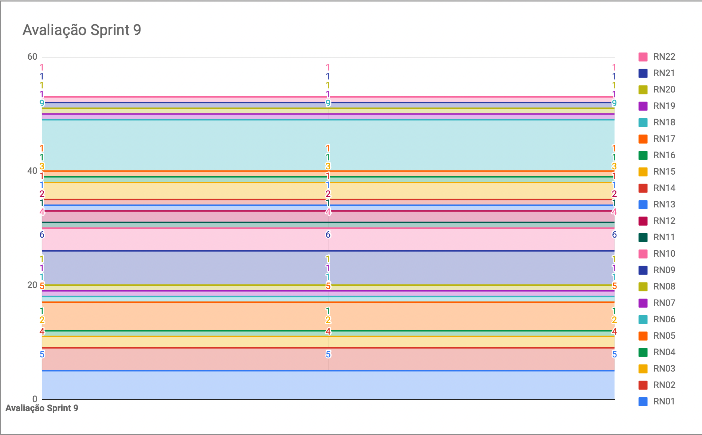
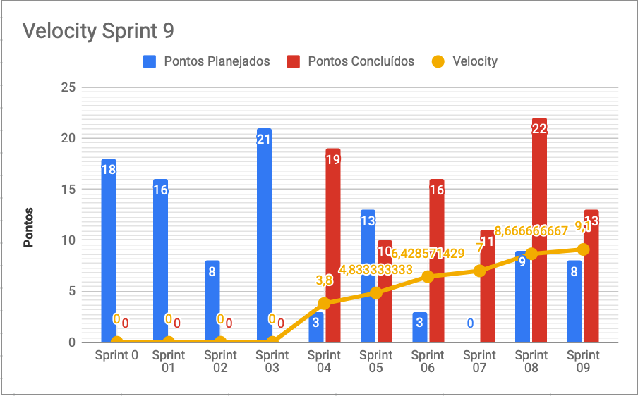

# Resultados da Sprint 9

|    Data    | Versão |         Descrição         |           Autor(es)           |
| :--------: | :----: | :-----------------------: | :---------------------------: |
| 30/10/2021 |  1.0   | Resultados da *Sprint* 9 | [Pedro Rodrigues](https://github.com/pedro-prp) |
| 06/11/2021 | 1.1 | Atualização da tabela de fechamento da *Sprint* e *Retrospective* | [Lucas Fellipe](https://github.com/lucasfcm9) |

**Data**: 30 de Setembro de 2021

**Redigida por**: Pedro Rodrigues

**Participantes**: 
* Daniel Coimbra (MDS)
* Gabriel Freitas (MDS)
* Iuri Severo (EPS)
* João Pedro (EPS)
* João Victor (MDS)
* Natan Tavares (MDS)
* Paulo Henrique (MDS)
* Pedro Rodrigues (EPS)

## Fechamento da Sprint

| Issue | Pontos | Status | Observação |
| ----- | :----: | :----: | :----: |
| [E07US01 - Eu, como pesquisador, desejo filtrar os registros, para facilitar a minha busca](https://github.com/fga-eps-mds/2021.1-Pro-Especies-Docs/issues/84) | 3 | Não Concluída | - |
| [E03US04 - Eu como usuário, desejo filtrar os peixes afim de encontrar o peixe com mais facilidade](https://github.com/fga-eps-mds/2021.1-Pro-Especies-Docs/issues/121) | 5 | Concluída | - |
| [E07US02 - Eu,como pesquisador,desejo exportar os registros para fora do aplicativo, para melhores estudos sobre os dados registrados](https://github.com/fga-eps-mds/2021.1-Pro-Especies-Docs/issues/85) | 5 | Não Concluída | - |
| [E09US01 - Eu, como pescador, gostaria que meus registros sejam salvos enquanto eu não tiver conexão com a internet, para que eu possa enviá-los posteriormente uma vez que haja conexão](https://github.com/fga-eps-mds/2021.1-Pro-Especies-Docs/issues/75) | 8 | Concluída | - |
| Documentar *Sprint* | 0 | Concluída | - |
| Atualização do CI/CD para a geração de todas as métricas dos serviços | 0 | Concluída | - |

## Fechamento da Sprint

__Pontos Planejados:__ 8  
__Pontos Totais Concluídos:__ 13  
[Milestone Sprint 9](https://github.com/fga-eps-mds/2021.1-Pro-Especies-Docs/milestone/13)

## Review

* **Daniel Coimbra**: Não conseguiu entregar, espera conseguir entregar hoje a tarefa de exportar registros, agrega para o produto porque os pesquisadores poderão ter o registro em mãos.

* **Gabriel Freitas**: Essa semana pareou com o batista, mudou de *issue* na quarta feira, refez o *dropdown*, agrega para o produto, pois o usuário consegue ter mais facilidade ao filtrar ou criar um registro.

* **Iuri Severo**: Essa semana mexeu com o dado bruto do *SonarCloud*, os dados continuam incorretos, mas será corrigido, contribui pro projeto, pois ajuda a medir a qualidade da entrega.

* **João Pedro**: Essa semana ficou responsável pela história de salvar os registros, fez o levantamento de alguns *bugs*, como também criou novas telas no protótipo, contribui para o projeto, pois muitos usuários não terão acesso a internet em locais de uso do aplicativo, já com o levantamento de bugs, traz valor a qualidade do produto. 

* **João Victor Batista**: Essa semana pareou com o Freitas, ficou com terminar filtros da wiki, além de pegar a implementação dos *dropdowns*, contribui para o produto pois os filtros facilita o aprendizado e os *dropdowns* flexibiliza a criação de registros por usuários diferentes.

* **Natan Tavares**: Essa semana trabalhou com o Paulo e o Daniel na *issue* de exportar registro, não conseguiu contribuir muito. Ficaram presos nos *checkboxs*, com a lógica complicada.

* **Paulo Henrique**: Essa semana ficou com a issue de exportar registro, com o Natan e o Daniel, conseguiram implementar a lógica correta, e pareando com o Daniel, conseguiram fazer a lógica para aparecer ou não o *checkbox*, foi gratificante implementar visualização do botão de exportar, acredita que exportar registro pode ser importante para o usuário.

* **Pedro Rodrigues**: Essa semana ficou com a issue de puxar as imagens do dropbox para *Wiki*, conseguiu implementar o *script* que converte todas as imagens para base64, mas ainda não finalizou o envio das mesmas para o banco de dados.

### Gráfico de BurnDown de Riscos

### Velocity

## Retrospective

*O que precisamos começar a fazer:*

- Se organizar melhor;
- Dar um gás final para a finalização do projeto;
- Realizar os critérios de aceitação de forma mais clara para evitar o retrabalho;
- Dedicar mais tempo para a matéria (última *sprint*);
- Focar nas principais funcionalidades das histórias de usuário;
- Se comprometer mais com a disciplina, nessa reta final;
- *Commits* mais coesos;
- Prestar mais atenção nas mensagens enviadas no grupo.

*O que precisamos parar de fazer?*

- Faltar reuniões sem aviso prévio;
- Não falar dos impedimentos e dificuldades nas dailies;
- Depender dos outros para a realização das histórias de usuário;
- Deixar dívida técnica;

*O que devemos continuar fazendo:*

* Continuar sendo um grupo unido e solícito;
* Comunicar ações pelo grupo;
* Trabalho em equipe;
* Marcar os horários de pareamento;
* Apoio dos EPS 10/10;
* Comunicação entre os membros;
* Iniciar as *issues* o mais cedo possível.

## Quadro de Conhecimento
A equipe de EPS elaborou um quadro de conhecimento com tecnologias consideradas essenciais para o desenvolvimento do produto. É possível ter um *overview* das capacidades da equipe de desenvolvimento (MDS) e gerência (EPS).

<iframe src="https://docs.google.com/spreadsheets/d/e/2PACX-1vSHxsHZdF7aMhOiXfcXzaHDSFw3ABg2JLZFkUhKZ2YRlrnpeho33t196CHZIWyUXhRp2-MjVymqEp4a/pubhtml" width="170px" height="600px"></iframe>

## Avaliação do Scrum Master

 &emsp;&emsp;A <i>sprint</i> 9 foi bastante produtiva. Conseguimos entregar mais de 50% das Histórias de Usuário e estamos bem perto do nosso MVP (Produto Mínimo Viável). A equipe está bem unida e empenhada para terminar a disciplina e entregar o produto funcionando para o cliente.
